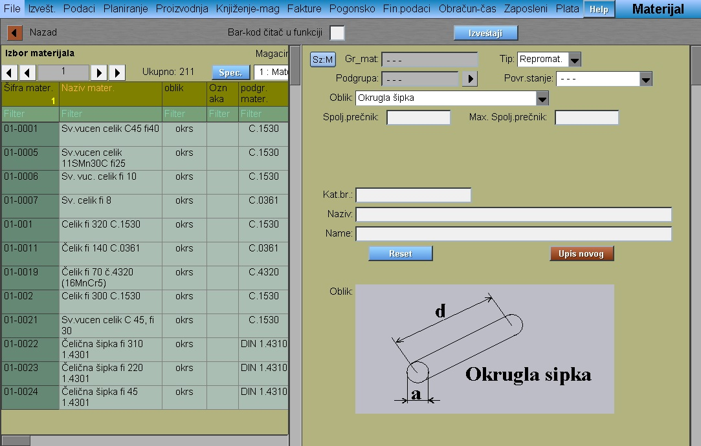
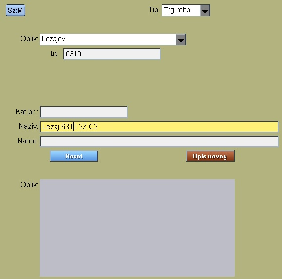
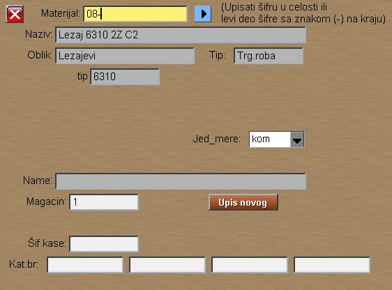
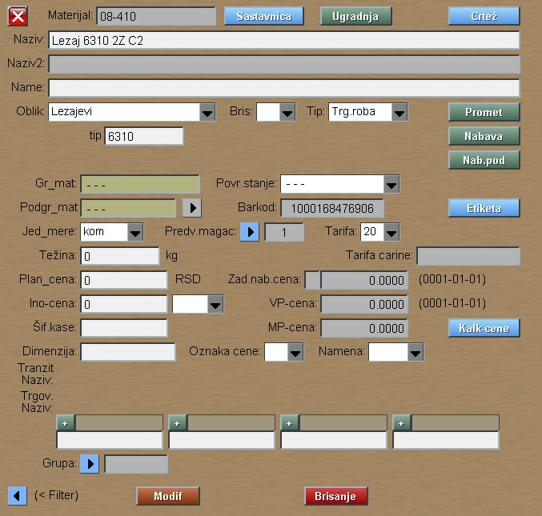

# Material

Program Material we got from [Datas](../m_en.md)

Program materijal prikazuje tabelu sa materijalima, odn. omogućuje modifikaciju podataka materijala i upis novih.

Materijal je stavka koju firma kupuje od drugih i ugradjuje u proizvod ili potroši prilikom proizvodnje.

Prozor je podeljen na levi deo koji služi za pregled materijala i na desni deo koji je za unos i modifikaciju
podataka jednog izabranog materijala.

## Upis novog materijala

Za upis novog materijala obavezno popuniti:
- Tip
- Oblik
- Naziv
zatim pritisnuti taster " Upis novog " 

U sledećem prozoru popuniti:
- Šifru materijala u celosti ili levi deo šifre sa oznakom (-) na kraju
- Izabrati jedinicu mere
- Predvidjeni magacin

Zatim pritisnuti taster " Upis novog " 

Dobijamo podatke upisanog materijala:

## Modifikacija podataka materijala

Na ovom prozoru postoje tasteri:
- Modif
- Brisanje
- Sastavnica
- Ugradnja
- Crtež
- Promet
- Nabava
- Nab.pod
- Etiketa
- Kalk-cene

