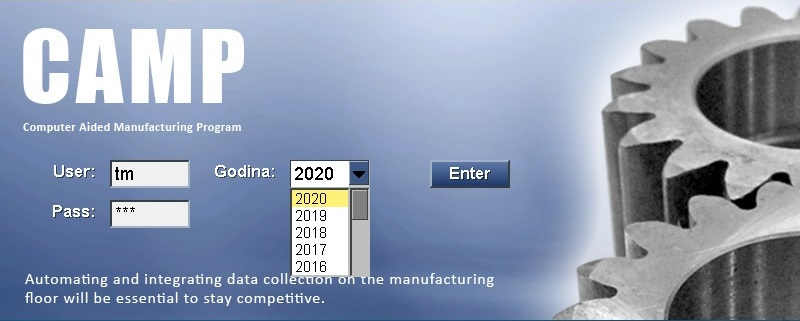

# Login

A program elindítását követően a következő ablak jelenik meg:

A billentyűzeten található `Tab` billentyű szolgál a mezők közötti ugrásra.

A "User:" mezőbe a felhasználó a felhasználónevet a "Pass:" mezőbe pedig a jelszavát írja.

Az "Godina:" mezőnél ki kell választani azt az aktív évet, amelyikben dolgozni akarunk.

A programba az `Enter` billentyűvel illetve a képernyőn található **Enter** gombbal tudunk belépni.
