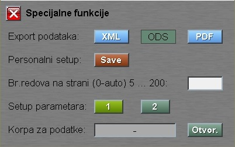

# Táblázatok

Táblázatok a program több részén is megjelennek. Az adatok megjelenítésére szolgálnak valamint lehetőséget adnak egyes adatok kiválasztására.

A táblázatok felett található az adott táblázat neve pl.: "Nyersanyag választás", nyilak mellyek lapozásra szolgálnak, "Ukupno:" a táblázat szűrt sorainak száma és a **Spec.** gomb.

A **Spec.** gombra kattintással megjelenik egy popup ablak.

"Export podataka:" menüpontnál a táblázatban szereplő adatok mentése történik választható **XML** vagy **PDF** formában.

"Personalni setup: " a **Save** gombra kattintva tudjuk menteni a változtatásokat. 

A "Specijalne funkcije" ablakot az **X** gombbal vagy a billentyűzeten található `Escape` billentyűvel tudjuk bezárni.

## A táblázat sorokból áll:

1. Oszlopok nevei
2. Filterek
3. Adatok sorai

## 1. Oszlopok nevei

Ahol a táblázatban szereplő oszlopok nevei találhatóak. A sorban szereplő bármelyik mezőre kattintva megjelenik egy popup ablak:

"Size:" a nyilakkal az oszlop szélessége változtatható.

Ha a "List:" melletti kockára kattintunk, akkor a táblázatban szereplő név alatti **Filter** mezőben megjelenik egy legördülő dropdown lista az oszlopban szereplő értékekkel.

"Rastući:" vagy "Opadajući:" mező melletti kockára kattintva kiválasztható, hogy az adott oszlop adatai növekvő vagy csökkenő értében jelenjenek meg. 

Az alul található nyilakkal tudjuk változtatni az oszlopok sorrendjét.

## 2. Filterek

A **Filter** mezőre kattintva be tudunk írni egy keresett kifelyzést és a program csak azokat a sorokat jeleníti meg amelyek a kért kifelyezést tartalmazzák.

Ha a **Filter** mezőre kattintunk megjelenik a mező elején egy betű. A betűre kattintva megjelin egy popupablak:

A legördülő listán ki tudjuk választani a keresés módját.

## 3. Adatok sorai

Az adatok megjelenítésére szolgáló rész. Az aktív részre (sötétzöld színű) kattintva lehetőságünk nyílik az adatok kezelésére.

