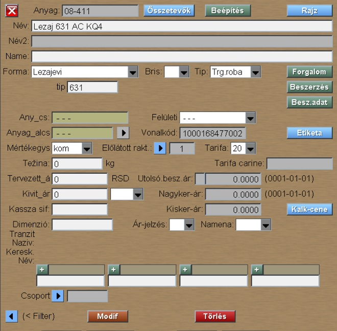

# Anyag

Az "Anyag" program az [Adatok](../m_hu.md) menüben van.

Az "Anyag" program az anyagok táblázatát jeleníti meg, illetve lehetőséget ad az anyag tulajdonságainak változtatására és új anyag beírására.

Az Anyag olyan tétel amit a vállalat vásárol és felhasznál a gyártásban vagy elhasznál a gyártás folyamán.

Az ablak ball oldala szolgál az anyagok áttekintésére, a jobb oldal pedig az új anyag bevitelére vagy egy kiválasztott anyag adatainak módosítására.

## Új Anyag bevitele

Ahhoz hogy új anyagot vigyünk be ki kell tölteni:
- Tip
- Forma
- Név

mezőket és rákattintani az **Új beírás** gombra.

A következő ablakban ki kell tölteni:
- az "Anyag" teljes kódja (sifra) vagy a kód eleje kötőjellel (-) a végén
- Mértékegység
- Raktár

és rákkattintani az **Új beírás** gombra.

Megjelenik az anyag adatait tartalmazó ablak.

## Az Anyag adatainak módosítása

Az ablakban szereplő gombok:
- **Összetevők**
- **Beépítés** - megmutatja melyik termékhez használja fel a cég a kiválasztott anyagot
- **Rajz** - megmutatja az anyaghoz tartozó dokumentációt (rajzot)
- **Forgalom** - megmutatja a kiválasztott anyaghoz tartozó raktári forgalmat
- **Beszerzés** - megmutatja a beszerzési adatokat
- **Besz.adat** (Beszerzési adatok) - lista azokról a beszállítókról akiktől a cég leggyakrabban vásárol
- **Etiketa** (Cimke) - cimke nyomtatása
- **Kalk-cene** (Ár kalkulátor) - itt lehet kiszámítani az anyag kereskedelmi árát
- **Modif** - a gombra kattintva a program elmenti a változásokat az adatázisba
- **Törlés** - a gombra kattintva a program leellenőrzni, hogy törölhetni-e a kiválasztott anyagot, ha igen, akkor törli az anyagot az adatbázisból
