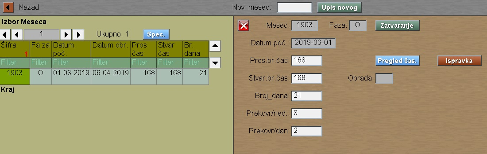
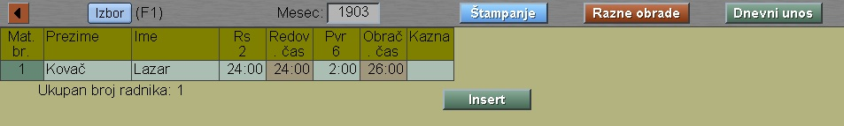
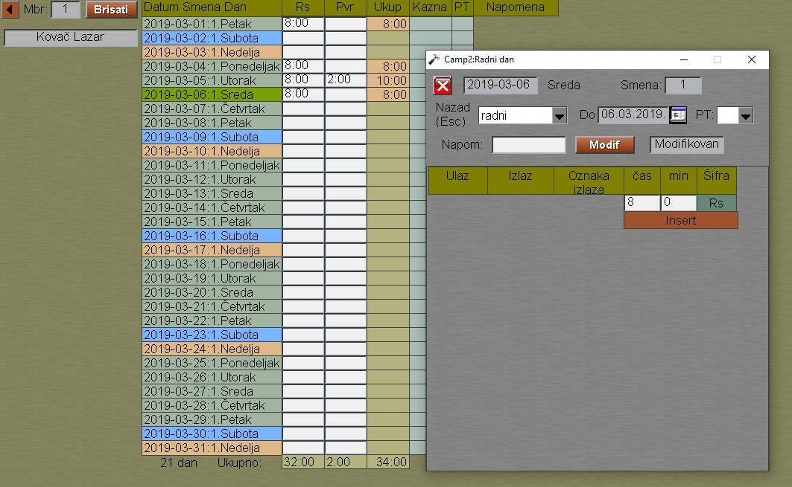

# Evident.čas

Program "Evident.čas" se poziva iz menija [Obračun-čas](../c_sr.md)

Program dozvoljava otvaranje novog meseca samo onda,
ako je prethodni mesec zatvoren.

Taster "Očitavanje" se pojavljuje samo onda kada
su definisani izvori ulazne evidencije.

U protivnom ulazimo u mesec klikom na taster "Pregled čas":

U startnom prozoru su zbirni podaci prisustva radnika.

Ako kliknemo na taster "Dnevni unos", onda imamo pregled
časova radnika za izabrani datum. Tu možemo i menjati
te podatke.

Ako izabrano jednog radnika , dobijamo mesečne podatke
tog radnika:

Ako kliknemo datum, onda imamo mogućnost dodavanja,modifikacije 
ili brisanja časova prisustva. 

Vreme ulaska i izlaska radnika se ne može menjati.
