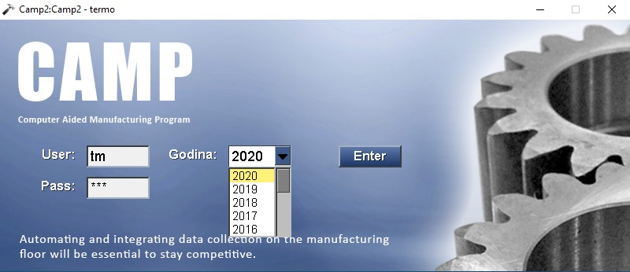

# Login

Posle startovanja programa dobijamo početni prozor: 

Taster `Tab` na tastaturi služi za prelazak između polja.

U polje " User: " korisnik upisuje svoj korisničko ime.

U polje " Pass: " korisnik upisuje svoju lozinku.

U polje " Godina: " se izabere aktivna godina
u kojoj želimo da radimo.

Taster `Enter` na tastaturi završava unos, ali
isto se dešava i klikom na dugme **Enter**

