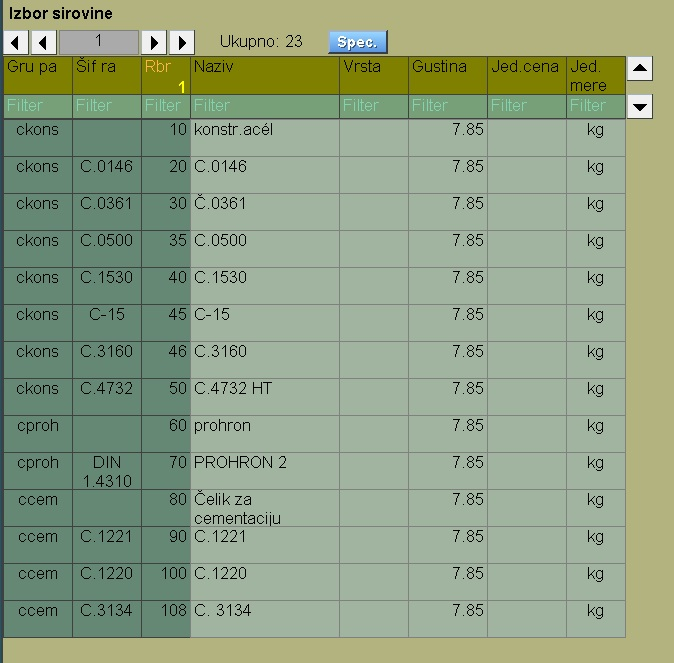

# Tabele

Tabele se pojavljuju svugde u programu.
Služe i za prikaz i za izbor nekog podatka za rukovanje.
Tabela se sastoji od horizontalnih delova:

1. Zaglavlje tabele , gde je naziv tabele, strelice za listanje
tabele po stranicama odn. taster `"Spec"`.
2. Red sa nazivima
3. Red sa filterima
4. Redovi sa podacima

## 1. Zaglavlje

## 2. Nazivi

## 3. Filteri

## 4. Redovi sa podacima
