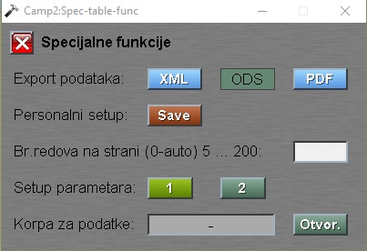

# Tabele

Tabele se pojavljuju svugde u programu.
Služe i za prikaz i za izbor nekog podatka za rukovanje.

U gornji deo se nalazi naslov tabele npr.: "Izbor sirovine", sterilce za listanje tabele po stranicama, ukupan broj filtriranih redova tabele i dugme **Spec.**.

### Dugme **Spec.** i funkcije

Sa klikom na dugme **Spec.** dobijamo popup prozor:

"Export podataka:" klik na **XML** ili na **PDF** sačuva podatke tabele u XML ili u PDF formatu.

"Personalni setup: " klik na **Save** spašava korisničko podešavanje tabele. 

Prozor "Specijalne funkcije" se zatvara sa dugmetom **X** ili sa tasterom `Escape`.

## Tabela se sastoji od horizontalnih delova:

1. Red sa nazivima
3. Red sa filterima
4. Redovi sa podacima

## 1. Zaglavlje

## 2. Nazivi

## 3. Filteri

## 4. Redovi sa podacima
