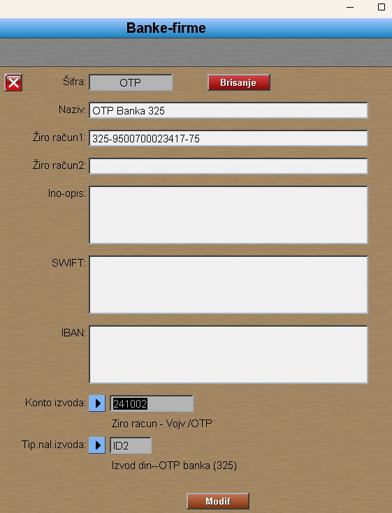
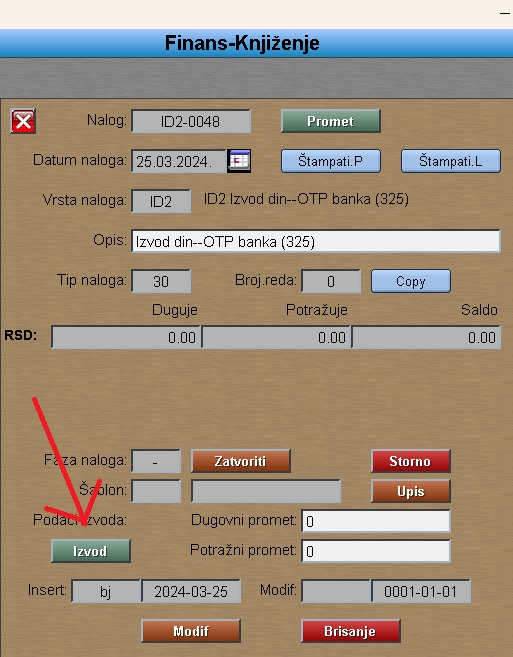
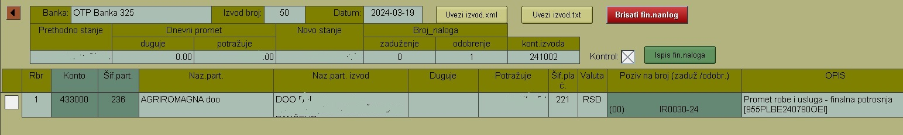

# Finans.Izvodi

Dokumentaciju "Finans.Izvod" pozivamo iz:  [Glavni meni](../../index_sr.md)

Proces za import Izvoda od OTP banke:

## 1. Upisati konto kod Banke OTP

## 2. Otvoriti Finans. nalog  za izvod:

## 3. Pritisnuti taster "Uvezi izvod.xml" 

Izabrati datoteku bez dodatnih oznaka: 

 2024-0000000000000000-00.xml
 
Program ne popunjuje konto, ali mozete rucno dodati konto.
Neked program ne nalazi sifru partnera, tada i to mozete rucno izabrati.
Ako ne zelite popuniti konto ili partner onda idete dalje tako sto brisete X
Kontrola : (bez X ).
Zatim birate "Ispis Fi.naloga"
Posle ovoga dobijete popunjen finansijski nalog. 

