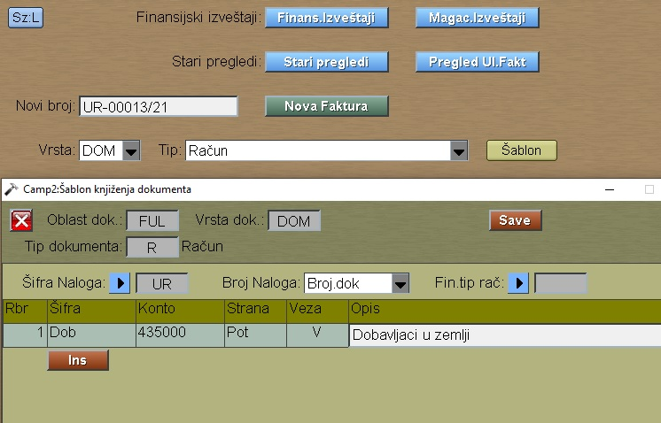
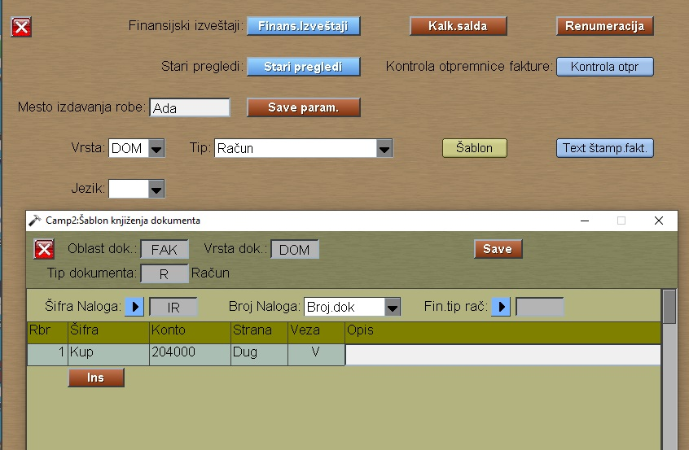
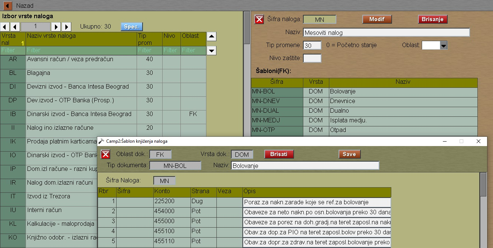
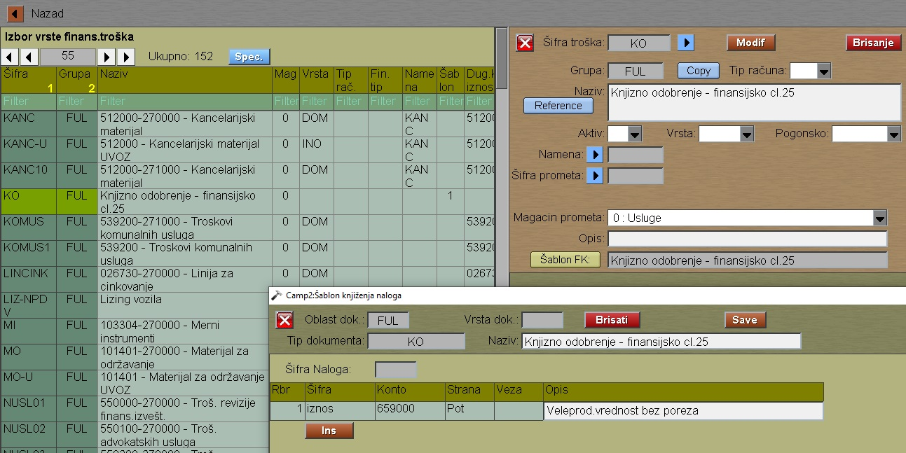

# Finans.Šabloni

Finansijski šabloni se pojavljuju na raznim mestima programa:

## 1. Kod ulaznih  faktura

Posle izbore vrsta i tipa dokumenta taster "Šablon"

Ostali redovi šablona su smešteni u zavisnosti
od vrste troškova UF.

## 2. Kod izlaznih faktura

Šabloni su u delu "Izveštaji"

Ovde možemo dodati i nove redove, ali možemo
definisati ostali redove šablona i kod vrste troškova IF.

## 3. Kod vrste finansijskih naloga

Posle izbora vrste naloga vidimo upisane šablone

## 4. Kod vrste finansijskih troškova

Posle izbora vrste troška možemo podesiti
dodatne redove za knjiženje.

