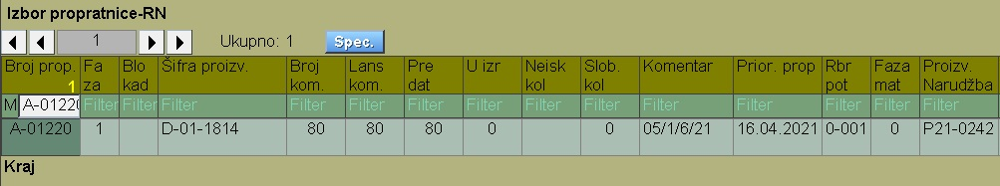
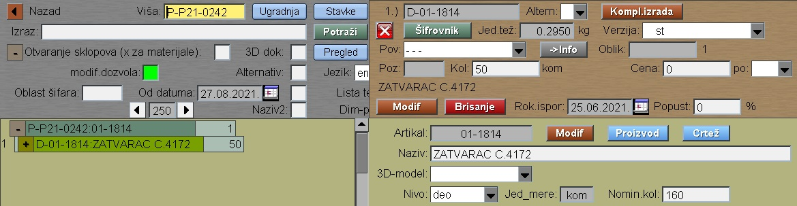
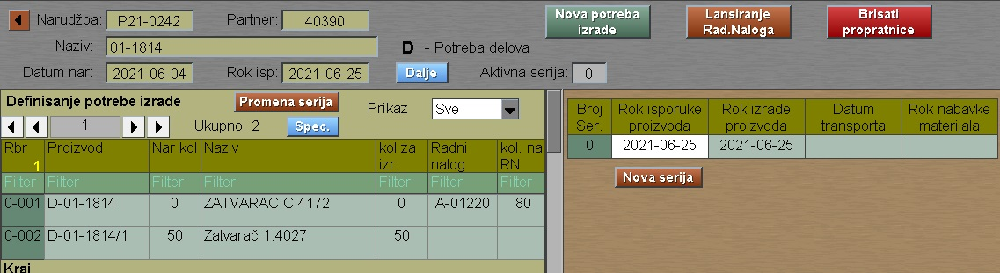
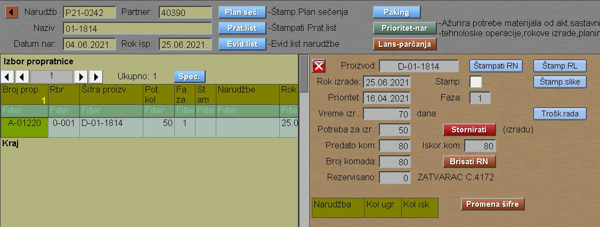
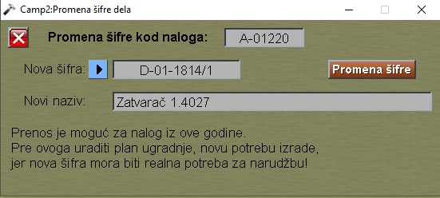

# Promena proizvoda Rad-Nal

Dokumentaciju "Promena proizvoda Rad-Nal" pozivamo iz:  [Glavni meni](../../../index_sr.md)

Ovaj postupak je potreban onda, kada posle startovanja RN-a želimo da menjamo proizvod koji se radi na tom nalogu.

Na nalog A-01220 su lansirali poziciju 01-1814 umesto 01-1814/1.
Prvo menjamo proizvodnu narudžbu P21-0242 u programu "Sastavnica" 
(ili u programu "Narudžba" pa taster "Komponenti"):

Klik na "Šifrovnik" menjamo proizvod na: D-01-1814/1 , pa "Modif".
Sada idemo na program "Planiranje" -> "Lansiranje" , biramo odgovarajuću narudžbu P21-0242 , zatim taster "Plan ugradnje" i "Novo rastavljanje".

Taster "Dalje" nas vodi do potrebe izrade. Tu radimo "Nova potreba  izrade" i dobijamo promenu u potrebama:

Tasterom "Dalje" idemo do lansirne dokumentacije sa nalozima.
Ovde biramo naš nalog:

Klik na taster "Promena šifre"  pa izbor te nove šifre 01-1814/1

Na kraju pritisnuti taster "Promena šifre" i posao je završen.
Šifra proizvoda je promenjena na svim mestima, gde figuriše taj nalog.

Jedino predaju u magacin GR moremo sami ispraviti , ako treba.
