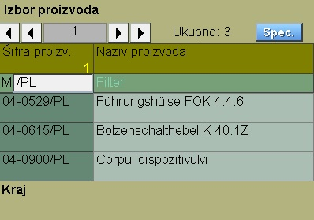
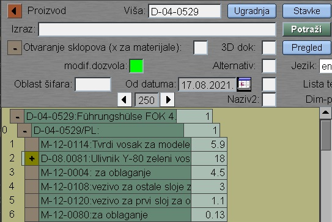
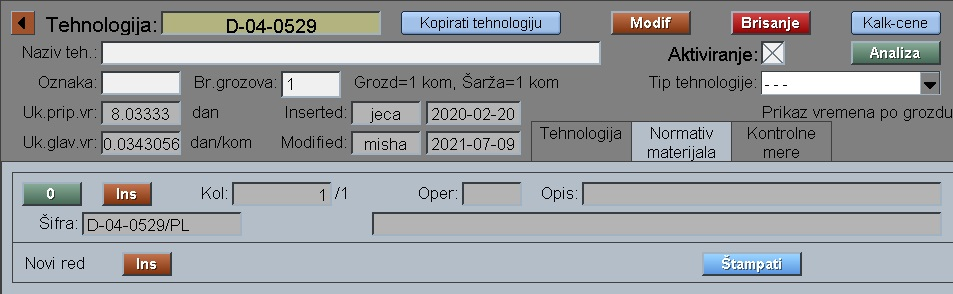
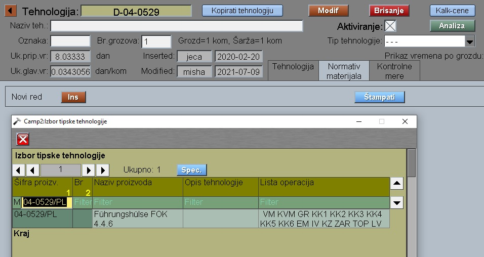
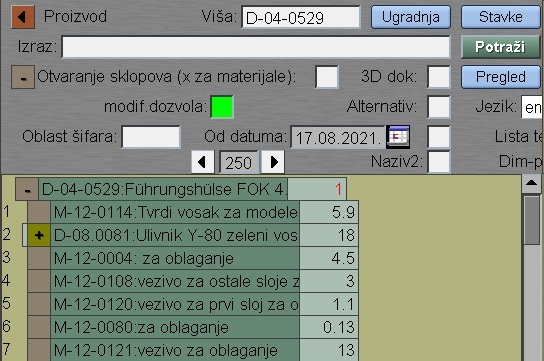

# Spajanje sastavnice

Dokumentaciju "Spajanje sastavnice" pozivamo iz:  [Glavni meni](../../index_sr.md)

Kod programa "Proizvod" filtriramo stavke nižeg nivoa

Izaberemo prvu , pa klikom na "Ugradnja" vidimo gde se ugradjuje. Tamo biramo stavku višeg ranga i program nas
prebacuje u program "Sastavnica"

Želimo tu nižu stavku (D-04-0529/PL) da izbacimo iz sastavnice i da njegov sastav i operacije prebacimo na višu stavku (D-04-0529).

Prelazimo na višu stavku i klik na "Proivod" nas vraća na program "Proizvod". Tamo biramo tehnologiju (D-04-0529) , zatim odeljak "Normaiv materijala".

Ovde brišemo prvi red, tako izbacujemo nižu stavku iz sastavnice. Desni klik na "Ins" i filtriramo nižu stavku:

Izborom te stavke dodajemo njen sastav.

Isto moramo uraditi i kod Tehnol.operacija.
Desni klik na "Ins" kod prve operacije pa ubacujemo
tehnološke operacije niže stavke ispred svih operacija.

S tim je posao završen. 
Vraćanjem na sastavnicu proizvoda  (D-04-0529) dobiamo sastavnicu bez niže stavke:

