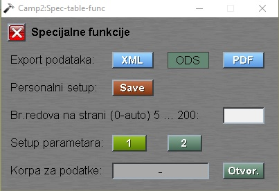

# Tabele

Dokumentaciju "Tabele" pozivamo iz:  [Glavni meni](../../index_sr.md)

Tabele se pojavljuju svugde u programu.
Služe i za prikaz i za izbor nekog podatka za rukovanje.


U gornji deo se nalazi naslov tabele npr.: "Izbor sirovine", sterilce za listanje tabele po stranicama, ukupan broj filtriranih redova tabele i dugme **Spec.**.


Sa klikom na dugme **Spec.** dobijamo popup prozor:

"Export podataka:" klik na **XML** ili na **PDF** sačuva podatke tabele u XML ili u PDF formatu.

"Personalni setup: " klik na **Save** spašava korisničko podešavanje tabele. 




Prozor "Specijalne funkcije" se zatvara sa dugmetom **X** ili sa tasterom `Escape`.

## Tabela se sastoji od horizontalnih delova:

1. Red sa nazivima
2. Red sa filterima
3. Redovi sa podacima


## 1. Red sa nazivima

Gde se nalazi nazivi kolone u tabeli. Sa klikom na bilo koje polje u redu dobijamo popup prozor:


"Size:" sa strelicama se menja širina kolone.

"List:" kad se stavlja *X* u kocku, ispod naziva u **Filter** polja daje opadajuću listu svih vrednosti te kolone.

"Rastući:" i "Opadajući:" kad se stavlja *X* u kocku, vrednosti u koloni su sortirani uzlaznim ili silaznim redosledom.

Sa strelicama ispod možemo menjati redosled kolona.

## 2. Red sa filterima


Klikom u polje **Filter** možemo upisati neki izraz i program filtrira samo one redove koji sadrže taj izraz u toj koloni.

Klikom na početno slovo polja dobijamo popup prozor:


Na opadajućoj listi možemo izabrati način pretrage.

Ako je podatak u koloni datum, onda ona može imati:
```
- iso-format (sa znakom -):  mm-dd  ,  yyyy-mm-dd
- ili srpski format (.):     dd.mm  ,  dd.mm.yyyy
```
## 3. Redovi sa podacima

Služe za prikaz podataka. Samo aktivna polja (tamno zelena) daju mogućnost dalje obrade poadataka.