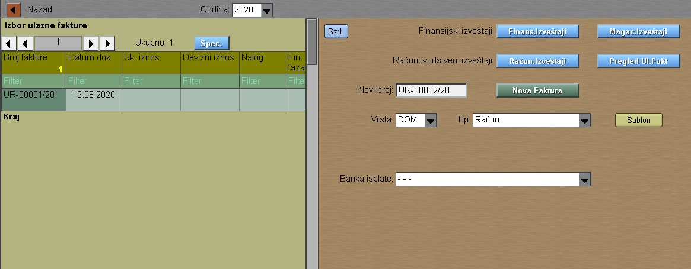
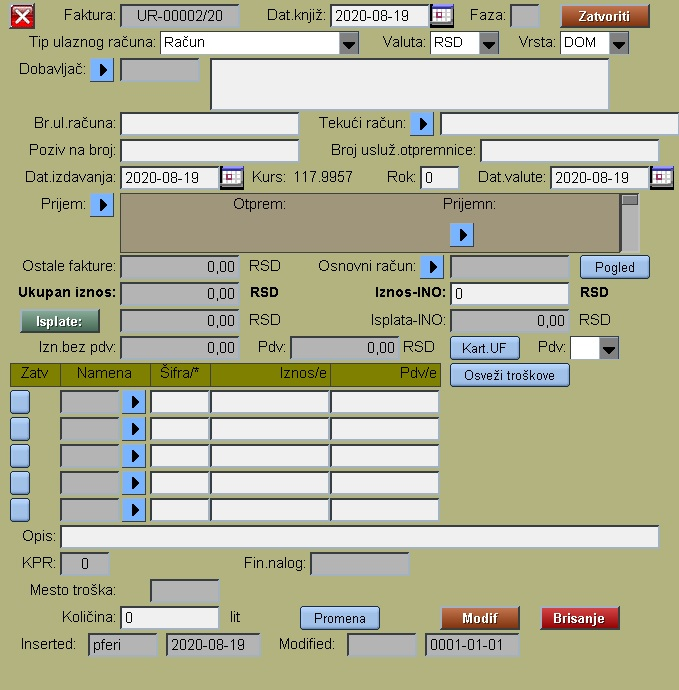

# Ulazne-Fakture

Program Ulazne-Fakture se poziva iz menija [Fakture](../f0_sr.md)

Za upis novog ulaznog računa prvo izabrati:
- vrstu računa ( DOM , INO)
- Tip računa ( moguće tipove posebno deklarisati )
Posle ovoga program automatski nudi sledći slobodan broj računa, 
treba samo kliknuti na taster "Nova Faktura" da bi imali upisan
nov ulazni račun:

