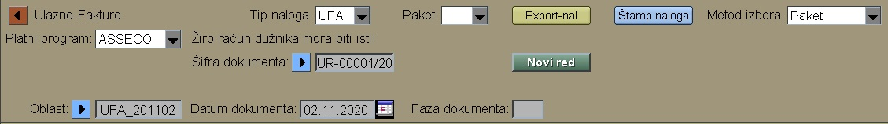
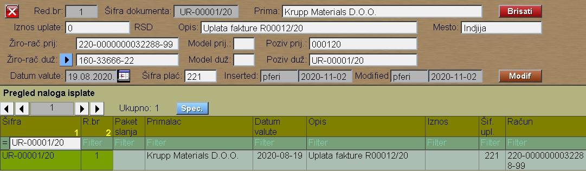

# Elektr-Isplata

Program Ulazne-Fakture se poziva iz menija [Fakture](../f0_sr.md),
ali ovaj program dobijamo i od programa "Ulazne-Fakture" i od 
programa "Obračun plate".

Pritiskom na taster "Novi red" dodajemo novi red plaćanja:

Taster "Export-nal" izvozi nalog plaćanja,
koji možemo kasnije uvoziti kod programa za elektronsko plaćanje .
Ugradjeni su programi HALCOM i ASSECO.

