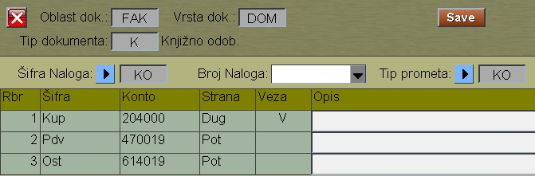

# Knjiženje-IF

Automatsko knjiženje IF je program koji se poziva iz programa [Izlazne-Fakture](mk312_sr.md)

## Knjižno odobrenje

Ovo je poseban tip računa, gde u prometnim redovima imamo upisane korekcije po računima:

```
tip:    K-knj.odobrenje
šifra:  Osnovni račun
kol:    1
cena:   Korekcija vrednosti osnovnog računa
```
Automatsko knjiženje program radi po ovim redovima koristeći šablon:



