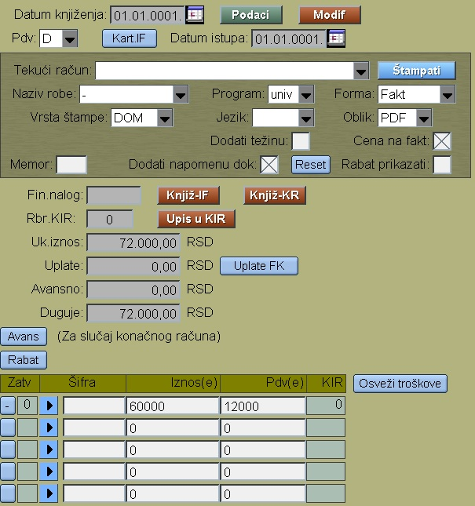

# Izlazne-Fakture

Program Izlazne-Fakture se poziva iz menija [Fakture](../f0_sr.md)

Za upis  nove fakture prvo treba odabrati 

- Vrstu računa (DOM,INO)
- Tip računa (Račun, Avans,Predračun, Knjižno odobr...)

Tipovi računa se definišu posebno za svaku firmu zajedno sa 
izgledom šifre računa za taj tip.
Pritiskom na taster "Nova Faktura" program nudi sledeću slobodnu šifru račina i otvara taj račun u bazi podataka:

Na prvoj strani tog novog računa menjamo datum računa , ako treba. Zatim sledi izbor kupca (obavezno), primaoca, odn. krajnjeg kupca iz tabele partnera [Partner](../mk308_sr/mk308_sr.md)

Upisujemo način plaćanja, rok isplate , odn. ostale parametre računa.
Na sledećoj strani su parametri štampe računa:

Taster "Knjiž-IF" služi za automatsko knjiženje izlazne fakture: 
[Knjiž-IF](knjiz_if_sr.md)

Pritiskom na taster "Podaci" ulazimo u deo programa za upis redova fakture:

Redove prodaje možemo uvesti i automatski:

- "Dodati Narudžbu" koji je kupac poslao
- "Dodati Otpremnicu" ako je već uneta
- "Dodati predajnicu" iz proizvodnje

Na desnom delu gornjeg ekrana imamo mogućnost uključivanja "Cene partnera",
koji daje specijalne proizvode i specijelne cene izabranog kupca.

Taster "Kalk.tež" služi za sumiranje težine svih komada.

Ako redove unosimo ručno, onda u prvi red prodaju upisujemo sa tasterom "Insert".

Posle upisanog reda novi red dodajemo tako što na Rbr1 tog reda stisnemo desni klik.

Levi klik služi za modifikaciju nekog reda fakture:

Tip reda biramo iz liste:
- Proizvod : iz tabele [Proizvod](../../m_sr/mk003_sr/mk003_sr.md)
- Narudžba : iz tabele [Narudžba](../../p1_sr/pr004_sr/pr004_sr.md)
- Radna usluga
- Materijal: iz tabele [Materijal](../../m_sr/mk002_sr/mk002_sr.md)
- Alat : iz tabele [Alat](../../m_sr/mk001_sr/mk001_sr.md)
- Avans
- Knjižno odobrenje
- Trošak
- Sniženje 
- Uslov
- Potpis
