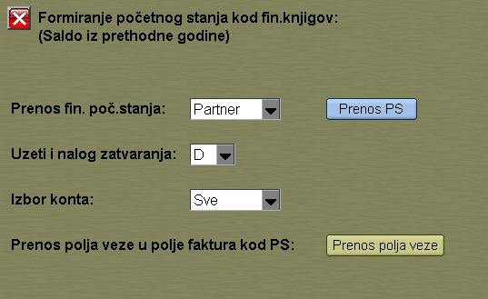

# Finans-obrade

Program "Finans-obrade" se poziva iz menija [Fin.podaci](../f1_sr.md)

Fijoka 1: Početno stanje za fin.knjigov.

Uzeti i nalog zatvaranja: D ( da ne filtrira naloge )

Uzeti i nalog zatvaranja :  N 
( Ako želimo izbeći nalog zatvaranja iz preth. godine, onda program nece uzeti naloge sa sifrom prometa >= 90 )

Izbor konta:  0-4,5-6   ( da prenosi do klase 4 ,
dok klasu 5-6 prenosi u zbiru na konto 340000 )
