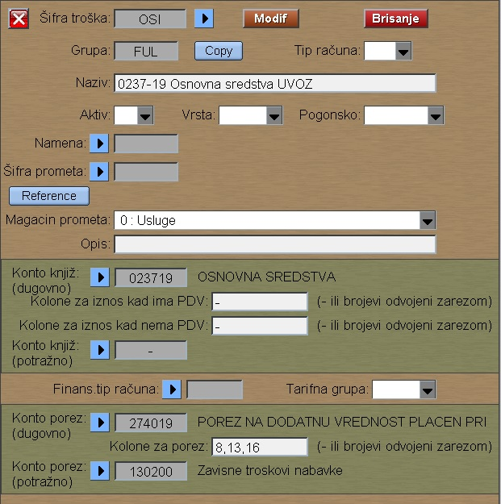

# Vrste-fin-troška

Program "Vrste-fin-troška" se poziva iz menija [Fin.podaci](../f1_sr.md)

Ovde definišemo način prenosa Ulazne fakture(FUL) u knjigu KPR,
kao i parametre automatskog knjiženja finansijskog naloga.

Na sličan način definišemo i parametre za Izlaze fakture(FAK) 
za prenos u knjigu KIR, odn. za automatsko knjiženje finansijskog naloga.

