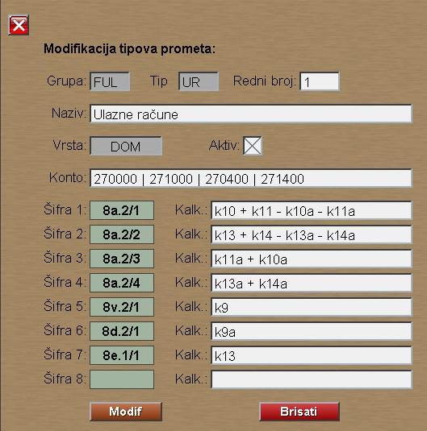
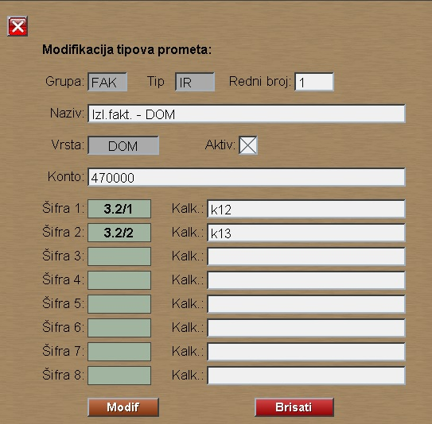

# Tipovi-fin-prom

Program "Tipovi-fin-prom" se poziva iz menija [Fin.podaci](../f1_sr.md)

Ovde definišemo način prenosa Ulazne fakture (Grupa: FUL) u formular evidencije PDV. 
Finansijski tipove (ovde: UR) otvaramo po potrebi.

Na sličan način definišemo i način prenosa Izlaze fakture (Grupa: FAK) u formular evidencije PDV.
Finansijski tipove (ovde: IR) otvaramo po potrebi.

