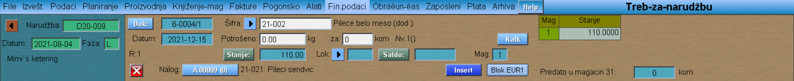
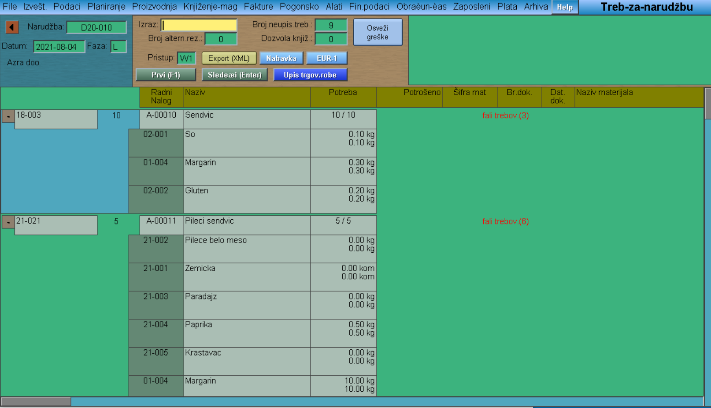
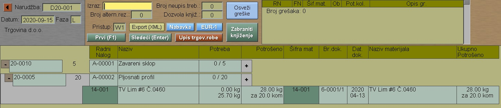

# Treb-za-narudžbu

Program "Treb-za-narudžbu" se poziva iz menija [Pogonsko](../g_sr.md)

Izaberemo našu narudžbu

Otvara nam se prozor gde se pojavljuju proizvod(i) sa njima pripadajućim radnim nalozima, materijalima i količinama koje je tehnolog predvideo. Klik na šifru materijala, otvaraju se nove opcije u gornjem delu prozora.

U polju Potrošeno, magacioner može da menja količinu materijala koju je zapravo izdao (znači, može da poveća količinu u odnosu na onu koje je tehnolog predvideo).

"Novi dokument" (6-xxxx/xx)

"Upis novog"

"Yes"

Ovim dokumentom se vrši izlaz materijala iz magacina materijala!

"Insert" (vršimo za svaki materijal)

"Zabraniti knjiženje"

(Napomena: Ukoliko je proces već startovan, a pojavi se potreba za još, npr. 5kg materijala, tada magacioner paralelno sa fizičkom predajom materijala ulazi u dotičnu narudžbu-dotični proizvod-radni nalog-materijal-u polje Potrošeno upisuje 5- Insert)

