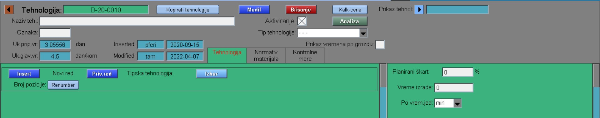
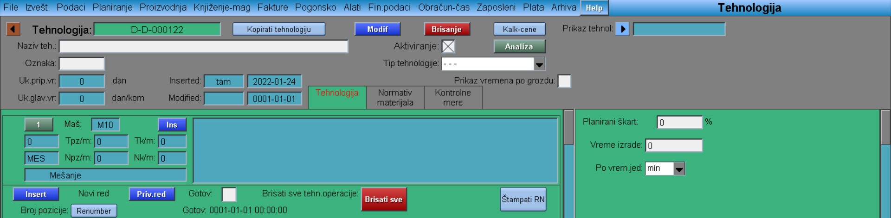
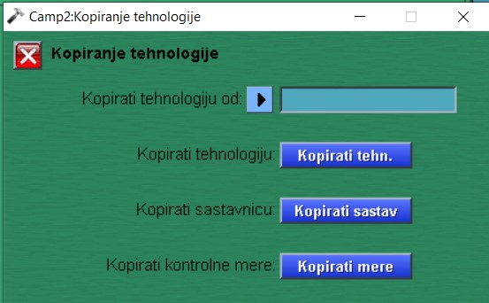
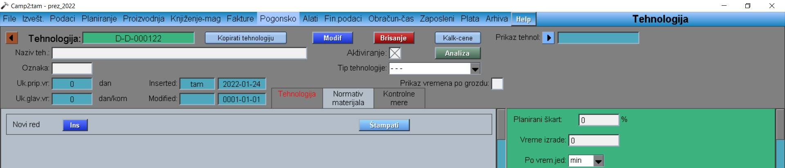
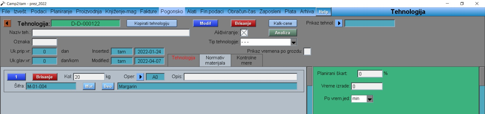

# Tehnologija

Program Tehnologija se poziva iz menija: [Hidden](../h_sr.md) , ili iz programa: [Proizvod](../../m_sr/mk003_sr/mk003_sr.md)

U novo otvorenom prozoru, na sredini zaglavlja, nalaze se 3 jezička:
- Tehnologija
- Normativ materijala
- Kontrolne mere

## Tehnologija

Klikom na dugme "Insert" otvara nam se prvi red, u koji je potrebno uneti:

- Naziv operacije klikom na strelicu padajućeg menija
- Klikom na dugme "Maš" biramo odgovarajuću radnu lokaciju
- Tpz-pripremno završno vreme
- Tk/m-vreme trajanja procesa (u minuti)
- Npz/m- Nk/m-normativ za radnika
- U veliko prazno polje možemo upisivati razne komentare ili napomene vezane za operaciju.

Klikom na dugme 1 (označava broj reda) zatvaramo red (takođe sa njim i otvaramo red). Dok klikom na dugme "Bris" brišemo red.

Sledeću operaciju, odnosno red, dodajemo klikom na veliko dugme "Insert", dok manjim dugmetom "Ins" dodajemo operaciju(red) između 2 već postojeće operacije(reda).

Postoji i mogućnost kopiranja tehnologije. Klikom na dugme "Kopirati tehnologiju", otvara nam se prozor gde možemo izabrati drugi proizvod čiju tehnologiju, sastavnicu ili kontrolne mere možemo kopirati.

Kada smo završili sa upisom tehnologije, na kraju liste se nalazi prazno polje Gotov, koje je neophodno označiti.

## Normativ materijala

Klikom na dugme "Ins" otvaramo prvi red gde unosimo prvi materijal koji ulazi u sastav našeg proizvoda. U okviru reda upisujemo:
- klikom na dugme "Mat" biramo materijal
- u polje Kol-upisujemo potrebnu količinu
- klikom na dugme "Oper." biramo operaciju
- u prazno polje Opis-a upisujemo željeni komentar

Klikom na dugme 1 (označava broj reda) zatvarmo (ili otvaramo) red.

Sledeći red otvaramo klikom na dugme "Ins" ispod postojećeg reda. Dok klikom na dugme "Ins" iznad postojećeg reda, ubacujemo red između.

Na kraju Modif.