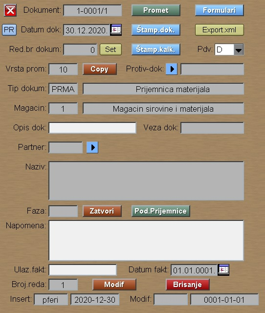

# Knjiženje-mag

Program "Knjiženje-mag" se poziva iz menija [Knjiženje-mag](../k_sr.md).

## Upis novog dokumenta

Za upis novog dokumenta moramo izabrati magacin i tip dokumenta.
Izbor partnera nije obavezan. Posle tastera **Novi Dokum.** 
program nudi sledeći slobodan broj dokumenta:

U ovom prozoru možemo menjati datum dokumenta kao i prethodno izabrani
tip i magacin dokumenta.

Ovde postoji i mogućnost:
- Faktura:  Kreiranje dokumenta na osnovu upisane fakture
- Import-dok: Import podataka iz xml datoteke.
- Copy-dok: Kopiranje podataka iz drugog dokumenta.

Pritiskom na taster **Upis** upisujemo podatke u bazu i dobijamo ekran:

Taster **Promet** nas ubacuje u novi ekran, gde možemo upisati
prometne redove dokumenta: 

Taster **Novi red** dodaje novi red na kraj, dok
taster **Insert** insertuje novi red na željeni redni broj.

Taster **Kalk** nam pomaže kod kalkulacije težine repromaterijala.
