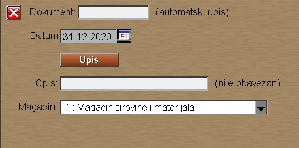
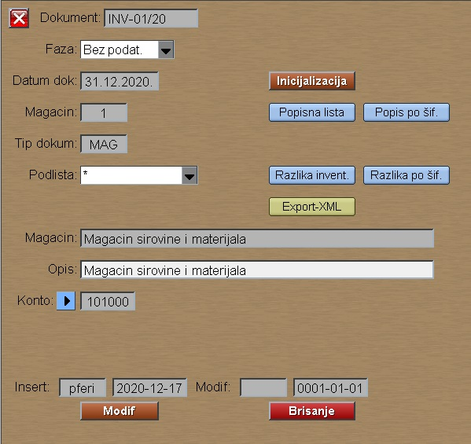

# Inventar

Program "Inventar" se poziva iz menija [Knjiženje-mag](../k_sr.md) .

Program "Inventar" na jednom mestu prikazuje inventare vezane za materijalno knjigovodstvo.

## Upis novog inventara

Za upis novog inventara moramo izabrati magacin.
Program automatski dodeljuje datum i naziv inventara,
ali to možemo zadati i mi sami.
Kada pritisnemo taster **Upis** 
dobijamo novootvoreni inventar, a novi red se otvara u tabeli za svaki magacin posebno :

Sad je inventar u fazi "Bez podataka".

Ako želimo preneti stanje magacina u inventar,
onda moramo startovati potprogram "Inicijalizacija". Klikom na ovo dugme pojavljuje nam se sledeća poruka:

-	Upisati nađeno stanje? –NO (mi ćemo sami upisivati)
-	Upisati nađeno stanje? – YES (upisuje magacinsko stanje)

Faza: Otvoren-Modif

**Faze: Kreiran-nije moguće unositi izmene, Otvoren-moguće je unositi izmene, Zatvoren-nije moguće unositi izmene

Postoji i programski deo za unos nadjenog stanja.
i to tako što je moguća podela stavki na grupe, 
pa svaka grupa ima svoje korisnike, koji mogu da upisuju stanje.

**Formiranje**-služi za kreiranje Grupa

Ta podela je tako što se ubaci neki filter, 
koji grupiše podatke, pa se ta grupa odvoji od ostalih,
pa tako redom i sledeći filter, pa kreiranje grupe .. itd..

Objašnjenja: klikom na dugme Grupe otvaraju nam se alatke za kreiranje i brisanje grupe
-	U koloni Tip ručno podesiti odgovarajući filter (npr. Tip:T)
-	U polje Šifra grupe upisati naziv grupe
-	Klikom na dugme Upis grupe, memoriše se podešeni filter pod šifrom grupe
-	Klik na OK u poruci koju dobijemo
-	Grupa-sadrži listu kreiranih grupa
-	Brisati-briše podešene grupe

**Popisna lista** (za štampanje-stavke sa stanjem)-uslov za štampanje je Otvorena faza

**Popis po šifri**-štampa listu sortiranu prema šifri proizvoda

**Dozvole upisa** (uslov za upis dozvole je da je faza Kreiran) 
Najpre je potrebno izabrati dokument za cije korišćenje dodeljujemo dozvolu
Upis grupa-Korisnik za unos inventara-Dodati(upisuje dozvolu za izabranog korisnika, Oduzeti – briše dozvolu za izabranog korisnika)

Upis nadjenog stanja je moguć kada je faza inventara
"Otvoren" .

 Nakon ovog prelazimo u programski deo **Stanje inventara**

 Grupa-biramo željenu grupu ili prazan red ispod * ukoliko nismo kreirali grupe

Ukoliko raspolažemo bar-kod čitačem potrebno je označiti polje sa X

Tu će nam se pojaviti redovi stavki. Kako bi upisali broj komada za njih, neophodno je kliknuti na prazno polje dotičnog reda i prve kolone(Grupa)

Nađeno stanje-može se ručno upisivati

Modif

Kada smo završili upis svih komada idemo ponovo na **Kniženje mag.-Inventar**

Klik na dokument (željenog magacina)-klik na Razlika inventara

Razlika inventara je PDF dokument koji iskazuje Višak i Manjak

Nakon dobijenih viškova i manjkova potrebno je ponovo izbrojati stavke i ispraviti njihov broj u CAMP inventarskom dokumentu. Ukoliko se viškovi i manjkovi pojave i nakon ponovnog brojanja, tada je neophodno njihovo stanje navesti u Inventarnom izveštaju.
Knjigovodstveno stanje-Invent.stanje (Višak-Manjak)

Nakon završenog inventara može da se odštampa: Razlika po šiframa.

Posle upisa nadjenog stanja inventar staviti u fazu "Zatvoren".

