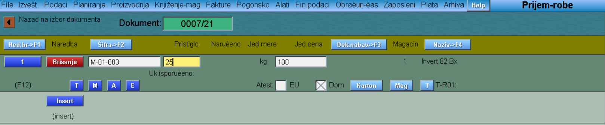
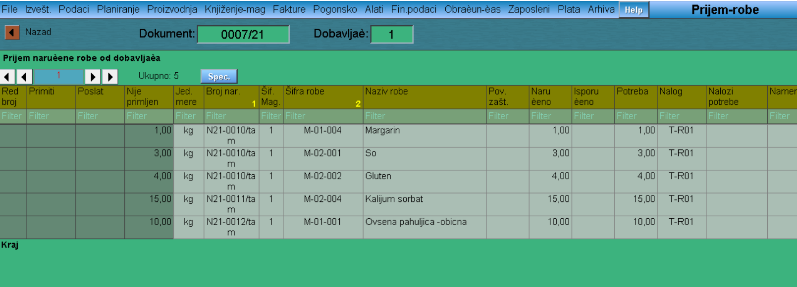
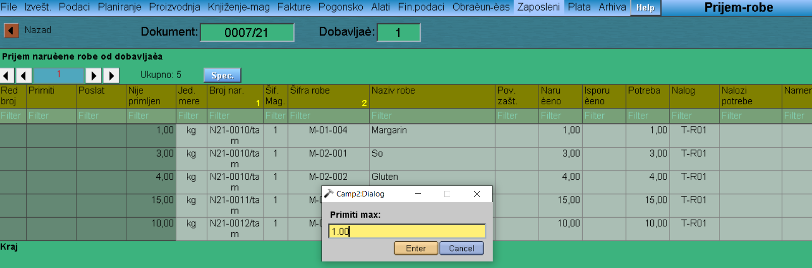
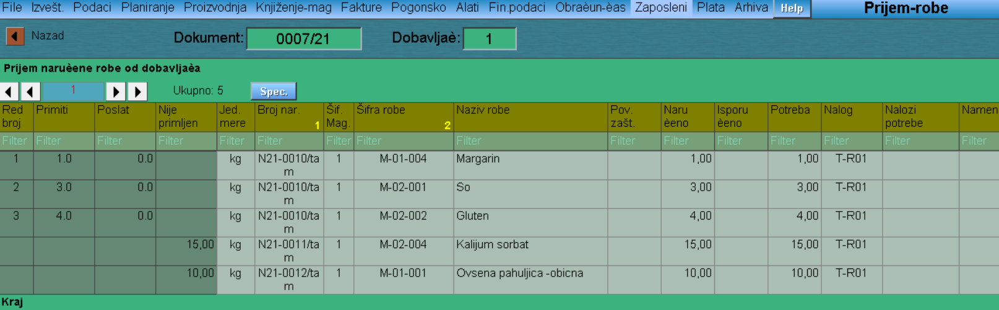
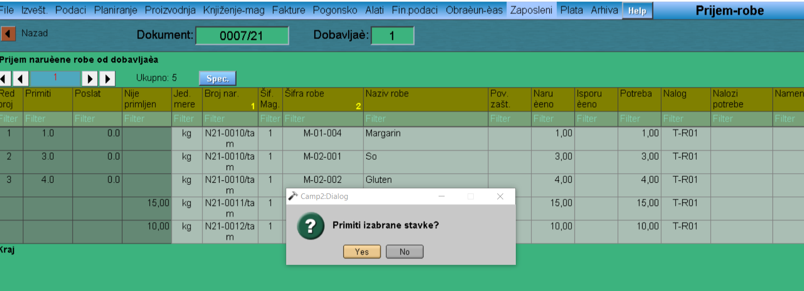

# Prijem-robe

Program "Prijem-robe" se poziva iz menija [Knjiženje-mag](../k_sr.md).

U početnom prozoru biramo odgovarajućeg partnera, podešavamo datum i otvaramo novi dokument klikom na dugme "Upis dok.".

Postoje 2 načina kreiranja dokumenta prijema:

1. "Promet" - ručno unosimo redove robe koja nam je pristigla

2. "Prijem robe" - biramo robu koja je vezana za određenu narudžbu, tj. koja je prethodno naručena

## Prijem robe preko dugmeta Promet

Klikom na dugme "Promet" otvara nam se novi prozor. Red otvaramo (takođe i zatvaramo) klikom na broj reda. U redu podešavamo sledeće stavke:  

 - Klikom na slovo M, otvara nam se tabela iz koje možemo da izaberemo materijal koji nam je pristigao
 
 - Pristiglu količinu
 
 - Jediničnu cenu

 - Vrstu magacina
 
 - Vrstu troška nabavke (klikom na slovo T)

 - Da li roba raspolaže evropskim ili domaćim poreklom.

 

 Vraćamo se na prozor prijema robe i idemo na dugme "Primiti". Na ovaj način nam je dokument prešao u fazu primljen, međutim treba ga još i proknjižiti.(programski deo Knjiženje mag.-Knjiženje prijema)

 ## Prijem robe preko dugmeta Prijem robe

Klikom na dugme "Prijem robe" otvara nam se prozor sa redovima onih narudžbi koje očekujemo od partnera kojeg smo izabrali.

Ukoliko kliknemo u prazno polje kolone Primiti i reda narudžbe koja nam je pristigla, izbacuje nam prozor u koji možemo ručno da unesemo primljenu količinu. 

Klikom na dugme Nazad, dobijamo pitanje 'Primiti izabrane stavke?' (biramo Yes) i vraćamo se na početni prozor programa Prijem robe.

Ovde biramo dugme "Primiti". Na ovaj način nam je dokument prešao u fazu primljen, međutim treba ga još i proknjižiti.(programski deo Knjiženje mag.-Knjiženje prijema)