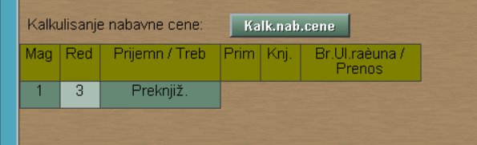
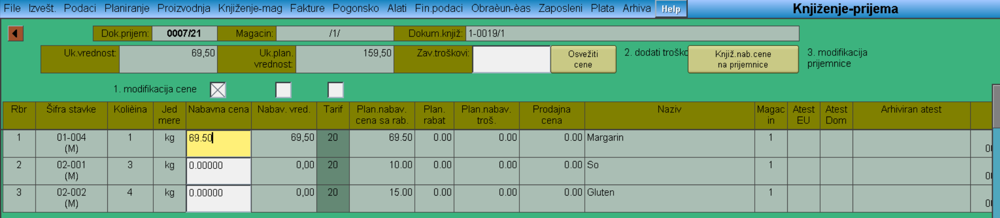
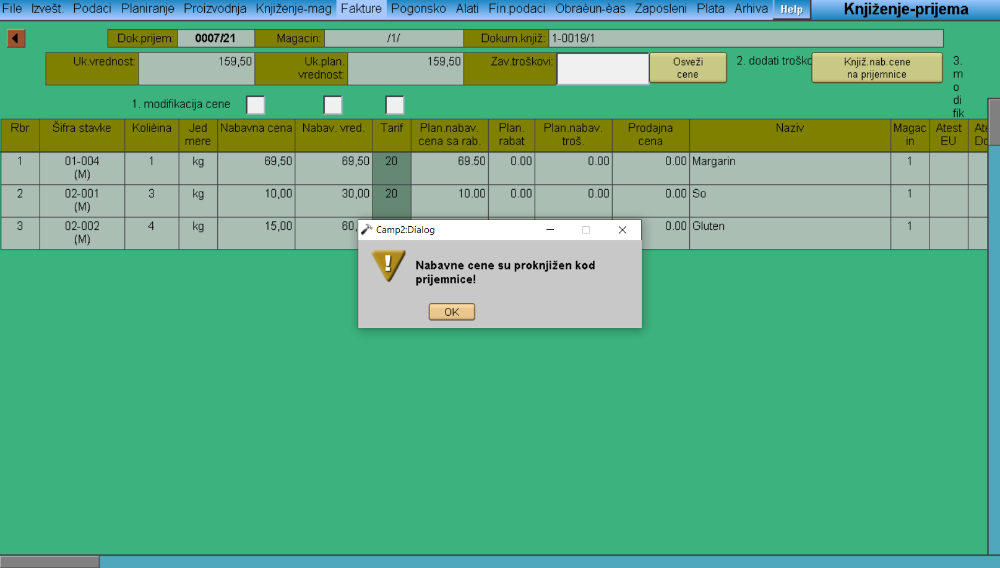

# Knjiženje-prijema

Program "Knjiženje-prijema" se poziva iz menija [Knjiženje-mag](../k_sr.md).

U levom delu prozora se pojavljuju prijemni dokumenti i klikom na broj dokumenta biramo naš dokument. U desnom, donjem delu prozora u okviru male tabele, klik na 'Preknjiž.' 

Pojavljuje nam se lista, u okviru koje možemo birati već postojeću prijemnicu ili generisati novu. Ako želimo da kreiramo novu prijemnicu, tada idemo na dugme "Enter" (u maloj tabeli se pojavio broj prijemnice). Klikom na dugme "Kalk.nab.cene" nam se otvara novi prozor gde možemo upisati nabavnu cenu svake stavke (a automatski ćemo dobiti i nabavnu vrednost). Klikom u kvadratiće pored teksta 'modifikacija cene', otvara nam se dotična kolona i omogućena nam je modifikacija vrednosti.

Nakon "Knjiž.nab.cene na prijemnice" dobijamo poruku sa 
'Nabavne cene su proknjižene kod prijemnice'. 

Ukoliko se vratimo na početni prozor našeg dokumenta i kliknemo na "Zatvoriti", faza našeg dokumenta će preći u Zatvoren. 