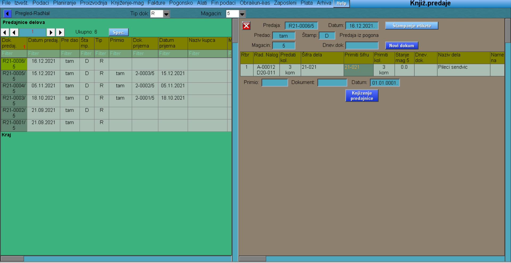

# Knjiženje-predaje

Program "Knjiženje-predaje" se poziva iz menija [Knjiženje-mag](../k_sr.md).

Sa leve strane nam se pojavljuje lista predajnica, biramo odgovarajuću klikom na nju.

"Novi dokument"  (2-xxxx/xx ; 2-označava predajnicu)

"Knjiženje predajnice"  (ovim je proizvod predat u magacin gotove robe).

"Štampanje etikete"  (mogućnost štampanja etiketa u željenim oblicima i formama).
