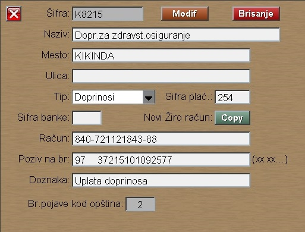

# Žiro-račun

Program Žiro-račun se poziva iz menija [Plata](../l_sr.md)

Tip žiro računa može da bude:

- N : Neto plata (dovoljan je Naziv)
- K : Krediti
- C : Članarina
- M : Mesni samodoprinos
- P : Porez
- D : Doprinos
- F : Fondovi

Ove šifre program koristi u drugim programima:
Opštine, Doprinosi, Članarine i kod Mat.podataka radnika.