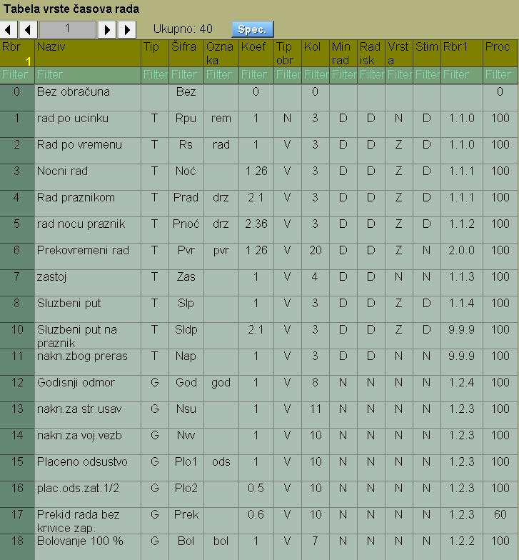
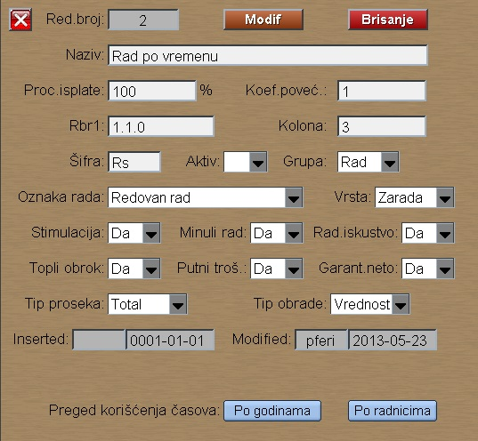

# Časovi

Program Časovi se poziva iz menija [Plata](../l_sr.md)

Časovi su obeleženi rednim brojevima.
Ovi redni brojevi su sada fiksni, naročito oni koji su
sa upisanim oznakama.
Oni se koriste i kod obračuna plate i kod evidencije časova.

Kod obračuna plate program koristi ovde definisane parametre.

Proc.isplate je informativni procenat.

Koefic.poveć. se koristi kod obračuna plate i utiče na iznos zarade.
Neki stavljaju da je ovaj koeficijent nula, ako se zarada refundira
od SIZ-a.

Ostali parametri koji utiču na cenu rada izabrane šifre:

- Aktiv: označava šifru koju obavezno štampamo na listi,	odnosno koja nije zabranjena za korišćenje.

- Tip proseka: za izbor proseka kod kalkulacije cene rada ove šifre.

- Stimulacija = Da, ako časovi ulaze u obračun stimulacije.
- Minuli rad  = Da, ako časovi ulaze u minuli rad.
- Rad.isk     = Da, ako časovi ulaze kod kalk. stimul. za radno iskustvo.
- Topli obrok = Da, ako časovi ulaze u kalkulaciju toplog obroka.
- Putni troš. = Da, ako časovi ulaze u kalkulaciju putnih troškova.
- Garant.neto = Da, ako časove uzimamo u obzir kod garantovane plate i ako zaradi pripada poreska olakšica.

Ako firma isplaćuje bolovanje na teret SIZ, pa kasnije refundira, onda je Garant.neto=Da , koef.poveć=1.

Ako firma ne isplaćuje Bolovanje na teret SIZ, onda kod
časova bolovanja staviiti Garant.neto=Ne , koef.poveć=0.

Prosek plate se računa od Bruto iznosa plate i od toga
program odvaja časove kod kojih je Vrsta = Naknada.
