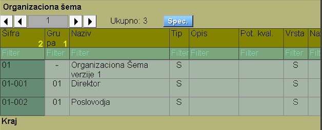

# Organiz.Šema

Program Organiz.Šema se poziva iz menija [Plata](../l_sr.md)

Organizaciona šema ima hierarhijsku strukturu i podeljena na grupe, zatim svaka šifra može biti podredjena nekoj drugoj.

Možemo uneti puno podataka za neki posao iz organ.šeme,
ali je bitan:
- Faza (Aktivan, Pasivan)
- Naziv posla
- Evidencija časova (Da,Ne)
- Vrta šeme (Radnik,Sektor,Porta)

Ostali podaci su važni ako štampamo opis delokruga rada, medjutim ti podaci zavise od načina rada konkretne firme.
Ovaj deo će biti kasnije preradjen.

