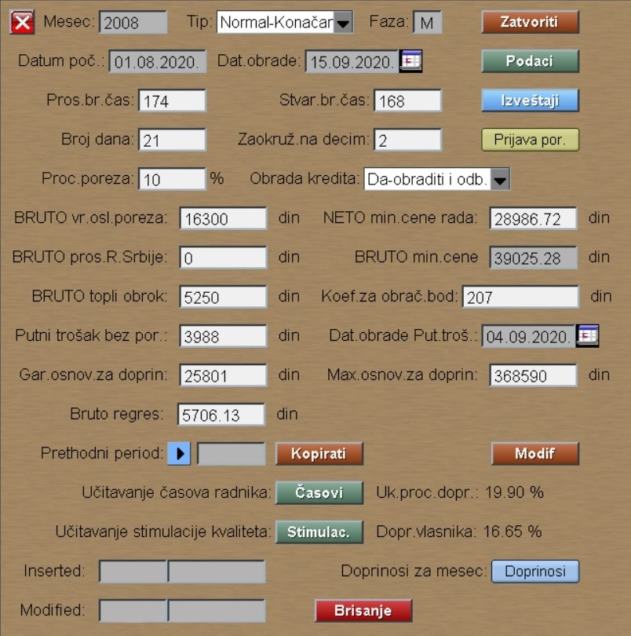
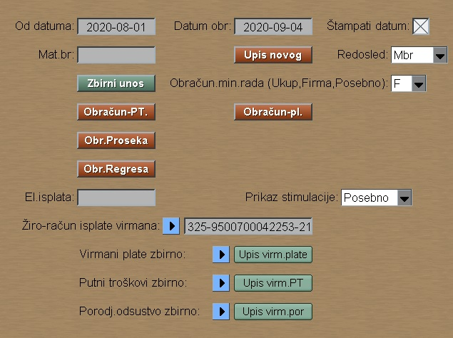
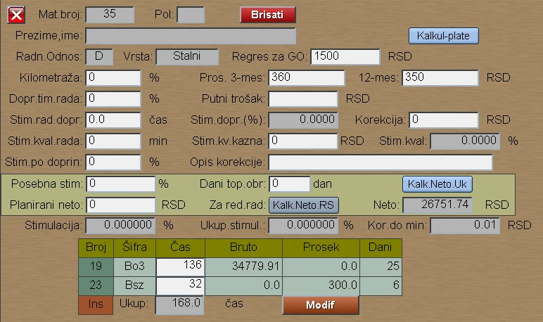

# Obračun Plate

Program Obračun Plate se poziva iz menija [Plata](../l_sr.md)

Pros.br.čas je prosečan mesečni broj časova.
Stvar.br.čas zavisi od aktuelnog meseca i dobijemo kao
proizvod broja dana sa 8.
Zaokruživenje iznosa možemo isto zadati.

Koef. za obrač. boda se množi sa iznosom Ebod upisanim
kod rasporeda radika: [Raspored-radnika](../../z_sr/ob104_sr/ob104_sr.md)

Pritiskom na **"Podaci"** ulazimo u deo sa podacima plate radnika:

Kod obračuna minulog rada izabrati:
- F za obračun dodatka samo na staž u firmi
- U za obračun dodatka na osnovu ukupnog staža

Taster "Obr.proseka" obavezno pritisnuti, ako želimo
automatski upis proseka svakog radnika.

Taster "Obr.Regresa" kalkuliše regres posebnim programom, ako je
taj program uključen kod firme, u protivnom upisuje fikni regres kod svakog.

Ostale obrade program radi kada pritisnemo taster "Obračun-pl.",
tj: obradu kredita,radnog staža,putnih troškova, naknade za porodj. 
i bolovanje preko siz.

Ako iz leve tabele kliknemo na konkretan radnik,
dobijamo podatke radnika za taj mesec:

Dole dodajemo časove radnika po šiframa rada.

Prosek i Dani ne moraju da se pune, samo u izuzetnim slučajevima.
Prosek onda, kada je prosek drugačiji od godišnjeg proseka.
Kod bolovanja obavezno puniti prosek.

Dane upisujemo onda, kada radnik ima platu na osnovu dve prijave ili
na osnovu dva (ili više ) reda prijave. 

Kasnije kod štampanja prijave program kontroliše sate i dane,
pa i MFP , da li je upisano.
