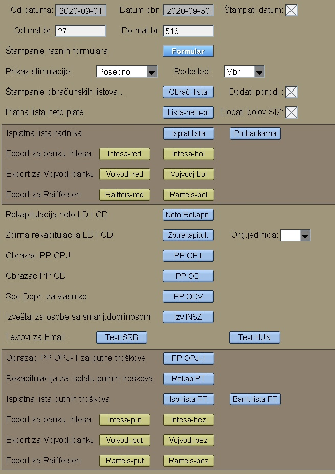

# Obračun Plate

Program Obračun Plate se poziva iz menija [Plata](../l_sr.md)


Pros.br.čas je prosečan mesečni broj časova.
Stvar.br.čas zavisi od aktuelnog meseca i dobijemo kao
proizvod broja dana sa 8.
Zaokruživenje iznosa možemo isto zadati.

Koef. za obrač. boda se množi sa iznosom Ebod upisanim
kod rasporeda radika: 
[Raspored-radnika](../../z_sr/ob104_sr/ob104_sr.md)

Pritiskom na **"Podaci"** ulazimo u deo sa podacima plate radnika:


Kod obračuna minulog rada izabrati:
- F za obračun dodatka samo na staž u firmi
- U za obračun dodatka na osnovu ukupnog staža

Taster "Obr.proseka" obavezno pritisnuti, ako želimo
automatski upis proseka svakog radnika:
```
Prosek = ( Uk.Bruto  - Naknade ) / ČasoviRada 
```
U slučaju da radnik nema časove rada, program uzima satnicu kao prosek uvećan za procenat minulog rada.

Taster "Obr.Regresa" kalkuliše regres posebnim programom, ako je
taj program uključen kod firme, u protivnom upisuje fiksni regres kod svakog.

Ostale obrade program radi kada pritisnemo taster "Obračun-pl.",
tj: obradu kredita,radnog staža,putnih troškova, naknade za porodj. 
i bolovanje preko siz.

Obračun putnih troškova zavisi od dnevnog iznosa. 
Taj iznos može biti upisan kod 
[Matič.pod.radnika](../../z_sr/ob102_sr/ob102_sr.md).
Tu mora biti X za označavanje ako radnik putuje.
Ako dnevni iznos ovde nije upisan, onda program uzima iznos od Opštine.

Ako iz leve tabele kliknemo na konkretan radnik,
dobijamo podatke radnika za taj mesec:


Gornji deo pokazuje parametre obračuna. Interesantno je na primer:

"Dani za topl.obr." - ako ne upisujemo, onda program kalkuliše te dane. Ako upišemo , onda program koristi taj broj.

Dole dodajemo časove radnika po šiframa rada. 
Šifarnik časova se definiše kod programa 
[Časovi](../ob002_sr/ob002_sr.md)

Prosek i Dani moraju biti upisani samo u izuzetnim slučajevima.
Prosek onda, kada je prosek drugačiji od godišnjeg proseka.
Kod bolovanja obavezno puniti prosek.

Dane upisujemo onda, kada radnik ima platu na osnovu dve prijave ili
na osnovu dva (ili više ) reda prijave. 

Kasnije kod štampanja prijave program kontroliše sate i dane,
pa i MFP , da li je upisano.

U gornjem delu ekrana taster **"Izveštaji"** otvara prozor sa raznim izvešteštajima:



"Obrač.lista" - za štampanje obračunskih listova svih radnika

"Lista-neto-pl" - za pregled neto plate radnika

"Isplat.lista"  - za pregled iznosa isplate radnicima.

U tim izveštajima možemo dodati (na teret SIZ):
- X : Dodati iznos za porodjajno 
- X : Dodati iznos za bolovanje 

Ako je obračun plate gotov, onda sledi kreiranje poreske prijave.
Ako je prijava poslata, onda dobijamo poziv na broj prijave.
To upisujemo na dokument prijave.

Posle ovoga sledi kreiranje virmana plate.
Upis virmana plate briše i ponovo upiše virmane.
Plava strelica startuje progam za virmane 

[Elektr-Isplata](../../f0_sr/fk108_sr/fk108_sr.md)
bez ponovnog kreiranja virmana.

## Putni trošak

Putni trošak mora biti upisan ili kod opštine ili kod osnovnih podataka radnika.

Uraditi obradu "Obračun-PT."

Kreirati i poslati poresku prijavu za PT.

Kreirati virmane za PT i exportovati u elektr.isplatu.

