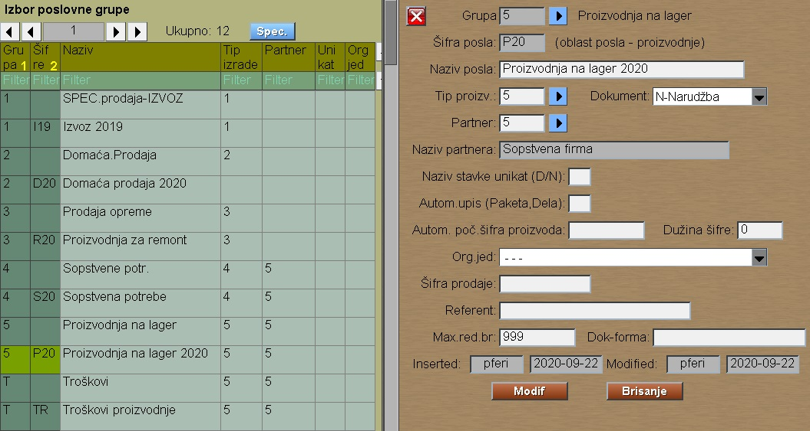

# Grupa poslova

Program Grupa polova se poziva iz menija [Osnov.Podaci](../m1_sr.md)

Svaka narudžba u programu pripada nekom poslu,
kojim se firma bavi.

Poslove grupišemo po tipovima proizvodnje, ili po
nekom drugom principu.

Ako ovde zadajemo šifru partnera onda se on automatski
upisuje kod otvaranja nove narudžbe.

Šifra partnera je šifra sopstvene firme
kod troškova ili kod proizvodnje na lager.

