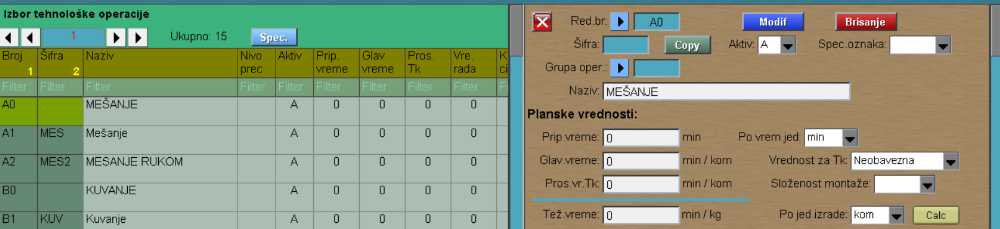

# Tehnološ.oper.

Program Tehnološ.oper. se poziva iz menija [Osnov.podaci](../m1_sr.md)

Prilikom upisivanja Tehnoloških operacija, najpre se otvaraju grupe operacija (npr. Oblaganje, Sečenje, Brušenje, Termička obrada,...). 

Na početnoj stranici u polje "Novi red.rb." upisujemo A0, B0,C0,... Zatim kliknemo na dugme "Upis". Otvara nam se prozor kao na slici ispod. U polje Naziv upisujemo naziv grupe operacije, polje Aktiv podešavamo na "A".

Nakon što smo otvorili grupu operacije, sledi otvaranje operacija unutar grupe (npr. Oblaganje-prvi sloj, Oblaganje-drugi sloj,...).
Na početnoj stranici u polje "Novi red.br". upisujemo A1,A2,B1,B2 i tako redom, dok u polje "Nova šifra" upisujemo skraćeni naziv operacije (npr. OBL1,OBL2,...). Otvara nam se prozor kao na slici.

U polje Naziv upisujemo naziv operacije, Aktiv podešavamo na slovo "A". Takođe možemo podesiti polja:

- Pripremno vreme
- Po vrem.jed. (minut, čas)
- Vrednost za Tk (Neobavezno, Fiksno i Obavezan upis).

Na kraju Modif.