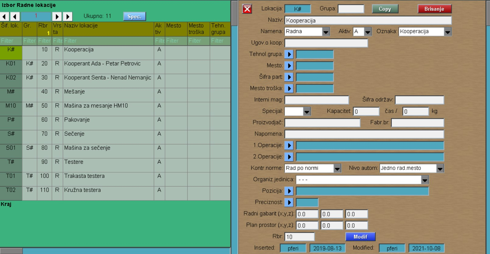
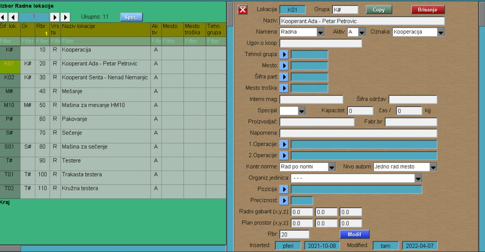

# Radne lokacije

Program Radne lokacije se poziva iz menija [Osnov.podaci](../m1_sr.md)

Prilikom upisivanja Radne lokacije, najpre se otvara grupa radne lokacije (npr. Kooperanti, Oblaganje,...). 

(U nastavku ce biti obrađen primer sa "Kooperanti"-ma. Nazive i oznake menjati po potrebi.)

U početnom prozoru, u polje "Nova lokacija" upisujemo K# i idemo na dugme Upis.

Primeri: 
- Kooperanti K#
- Oblaganje OBL#
- Sečenje S# ,....

U novo otvorenom prozoru:

- polje Grupa ostavljamo prazno
- u polje Naziv upisujemo naziv grupe lokacije
- Namena: Radna
- Aktiv: A
- Oznaka: Kooperacija

Nakon otvaranja grupe, sledi otvaranje radnih lokacija unutar grupe. U početnom prozoru, u polje "Nova lokacija" upisujemo K01 i idemo na dugme Upis. U novo otvorenom prozoru, kao na slici ispod:

- u polje Grupa upisujemo K# 
- u polje Naziv upisujemo naziv radne lokacije
- Namena: Radna
- Aktiv: A
- Oznaka: Kooperacija

Na kraju Modif.
