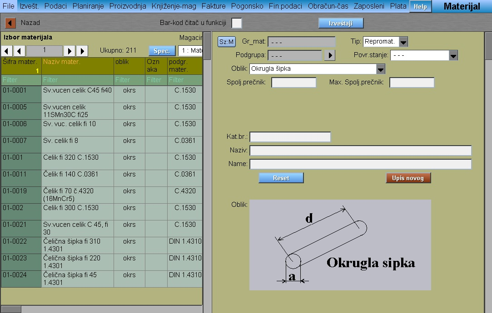
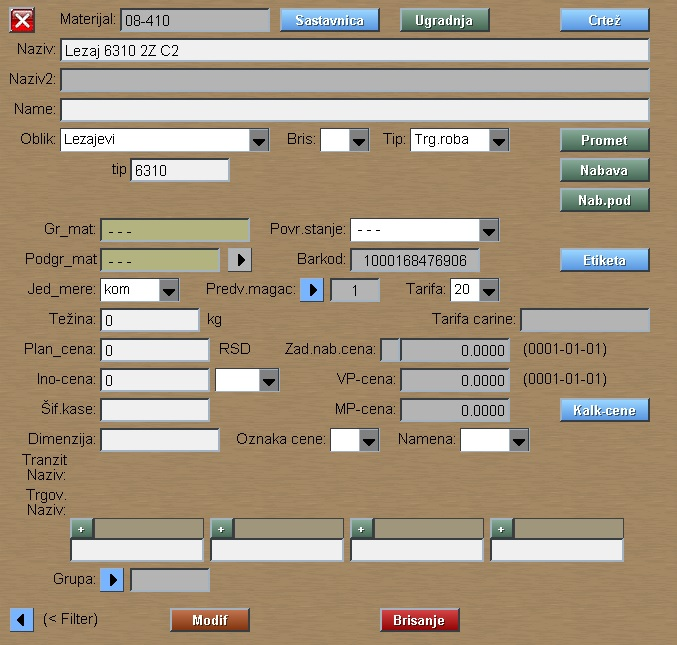

# Materijal

Program "Materijal" se poziva iz menija [Podaci](../m_sr.md)

Program "Materijal" prikazuje tabelu sa materijalima, odn. omogućuje modifikaciju podataka materijala i upis novih.

Materijal je stavka koju firma kupuje od drugih i ugradjuje u proizvod ili potroši prilikom proizvodnje.

Prozor je podeljen na levi deo koji služi za pregled materijala i na desni deo koji je za unos i modifikaciju
podataka jednog izabranog materijala.

## Upis novog materijala

Za upis novog materijala obavezno popuniti:
- Tip
- Oblik
- Naziv
zatim pritisnuti taster **Upis novog**

U sledećem prozoru popuniti:
- Šifru "Materijala" u celosti ili levi deo šifre sa oznakom (-) na kraju
- Izabrati jedinicu mere
- Predvidjeni magacin

Zatim pritisnuti taster **Upis novog** 

Dobijamo podatke upisanog materijala.

## Modifikacija podataka materijala

Na ovom prozoru postoje tasteri:
- **Sastavnica**
- **Ugradnja** - prikazuje u koje proizvode se ugrađuje materijal
- **Crtež** - prikazuje dokumentaciju (crteži) koji su vezani za taj materijal
- **Promet** - prikazuje promet u magacinima koji su vezani za taj materijal
- **Nabava** - pregled prometa i dokumenata nabavke
- **Nab.pod** (Nabavni podaci) - lista dobavljača od kojih firma najčešće kupuje
- **Etiketa** - štampanje etikete
- **Kalk-cene** - ovde firma upisuje trgovačku prodajnu cenu materijala
- **Modif** - sa klikom na dugme program spašava izmene u bazu podataka
- **Brisanje** - program briše izabrani materijal iz baze, ali pre toga proverava da li se taj materijal sme brisati

## Oblici repromaterijala maš.obrade

Oblici repromaterijala mašinske obrade su definisani unutar programa 
da bi program mogao da kalkuliše težinu i površinu tih delova.

- Ploča - kvad,krug,elip,trougao
- Kvad.traka
- Kvad.flah
- Profilna cev
- Šestougaoni OK
- Šestougaoni OK-cev
- Okrugla šipka
- Žica
- Okrugla cev
- L-profil
- I-profil
- T-profil
- U-profil
- Profil-spec
- Ploča bez dimenzije
- Odlivak,otkovak

Kod podataka repromaterijale program zahteva unos osnovnih mera
za dotični oblik. Pomoćne dimenzije program traži onda, kada radimo
kalkulaciju odsečenog lima za neki proizvod (kod definisanja sastavnice).

Na primer Ako je oblik lim, onda program zahteva upis debljine lima,
dok širinu i dužinu traži kod definisanja sastavnice.

Zbog ovoga mi ne moramo upisati novu šifru materijala, ako se taj
razlikuje samo u pomoćnim merama.

