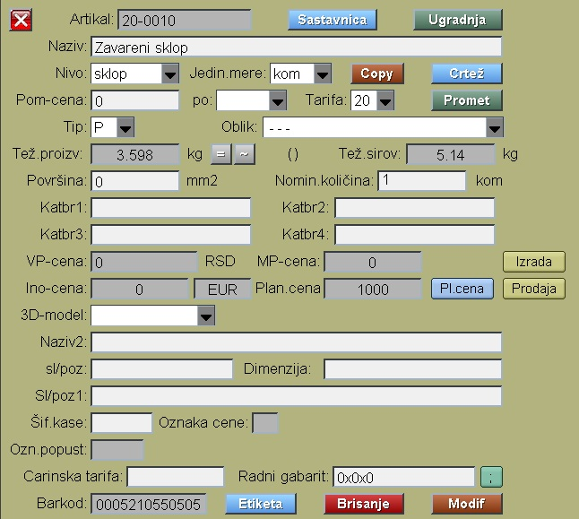
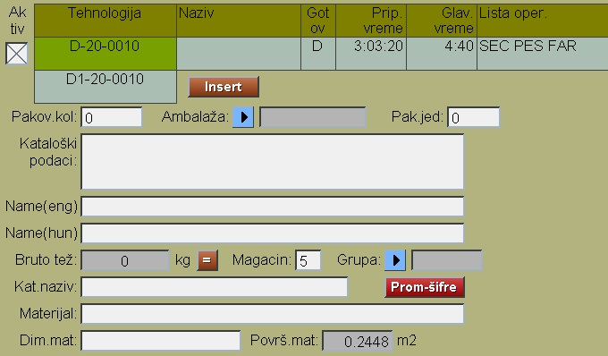

# Proizvod

Program Proizvod se poziva iz menija: [Podaci](../m_sr.md) .

Proizvodi se proizvode u firmi. Imaju tehnologiju , normativ, itd..

Proizvod može biti gotov (krajnji ) proizvod , i ulazi u magacin gotovih proizvoda,
i može biti poluproizvod, koji je samo u magacinu pogona ili u medjufaznom lageru.

Za upis novog proizvoda ovde moramo zadati šifru proizvoda u celosti 
i pritisnuti taster "Upis šifre"

U gornjem delu prozora punimo podatke:

- Naziv
- Nivo (deo,sklop,usluga,set,sl.deo,paket)
- Jedinicu mere
- Tarifni broj
- Nomin. količinu za normativ (ako je uključen)

U donjem delo prozora:

- Pakovana količina
- Pakovana jedinica
- Predvidjeni magacin

Pritiskom na taster "Insert" ovde dodajemo tehnološke podatke proizvodnje.

