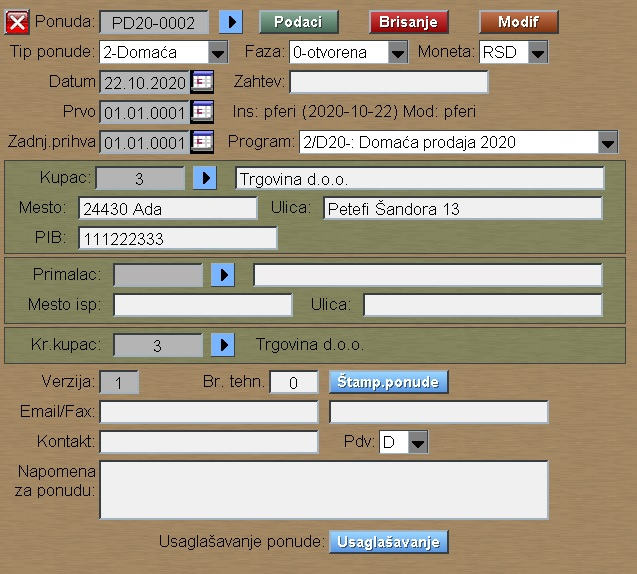
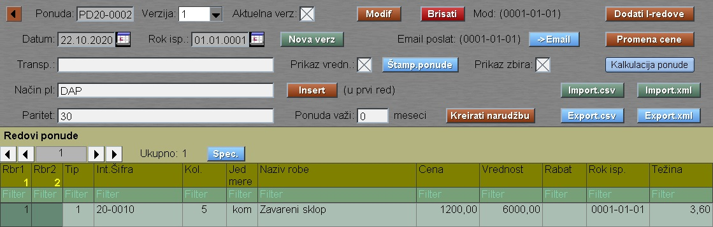
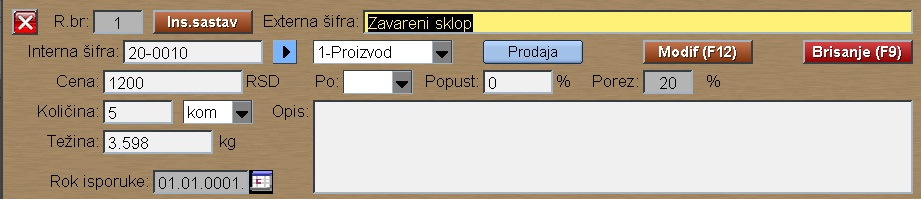

# Ponuda-podaci

Program "Ponuda-podaci" se poziva iz menija [Ponuda](../p10_sr.md)

Posle izbora grupe:

- PD :  za Domaću ponudu , ili
- PI :  za Inostranu ponudu

Klikom na taster "Upis nove" program nudi sledeći slobodan broj 
za ponudu i upisuje u bazu.

Podatke ponude zadajemo preko prozora:

Klikom na taster "Podaci" prelazimo na upis redova ponude:

Klik na "Insert" upisuje prvi red , dok desni klik na na Rbr1
dodaje novi red posle izabranog reda.
Desni klik na Rbr2 dodaje novi red na nivo 2 ispod izabranog reda.

