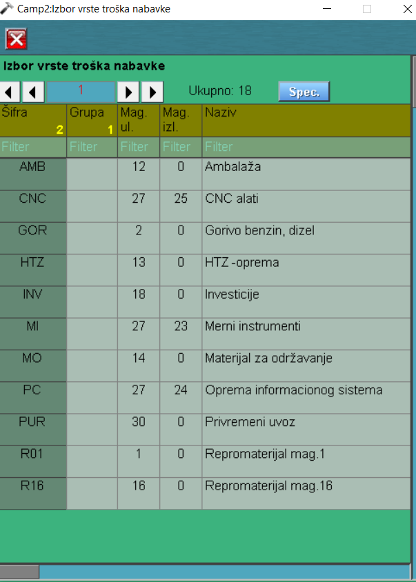
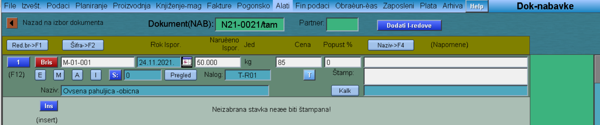

# Dok-nabavke

Program "Dok-nabavke" se poziva iz menija [Nabavka](../p11_sr.md)

Podešavamo datum dokumenta i klik na "Nova Narudžba Nabavke" dugme (Enter).

U gornjem delu nam se pojavi broj dokumenta (npr.N21/0021). Podešavamo Vrstu dokumenta, Valutu i Partnera.

Klikom na "Promet nabavke" nam se otvara novi prozor gde unosimo redove nabavke, dok klikom na dugme "Ins" otvaramo red i unosimo sledeće podatke:

- Naziv stavke (E-externa šifra, M-materijal, A-alat, I-informativni redovi dokumenta)
- Rok isporuke (klikom na sličicu kalendara)
- Količinu
- Cenu
- Popust
- Vrstu troška nabavke (klikom na slovo "T")

Nakon što smo uneli neophodne podatke, potrebno je zatvoriti red i to klikom na redni broj reda (na isti način se otvara red, u slučaju da nakon zatvaranja ipak želimo da izvršimo neke ispravke).
Vraćamo se nazad na početnu stranu dokumenta i on je sada spreman za štampanje  (fazu možemo podesiti na 1-Poslat).

"Štamp.nab." - štampanje dokumenta nabavke u pdf formatu

"Štamp.XML" - štampanje dokumenta nabavke u xml formatu

"Modif.nabav." - omogućava nam da izvršimo određene izmene u dokumentu

"nabav@email" - slanje dokumenta nabavke putem e-maila

## Kreiranje upita

Ukoliko želimo Upit da kreiramo tada koristimo:

"Promet upita" - kreiramo ga na isti način kao i dok.nabavke samo bez cene

"Štamp.upita(PDF)" - štampanje upita u pdf formatu

"Štamp.upita(XML)" - štampanje upita u xml formatu

"upit@email" - slanje upita putem e-maila

