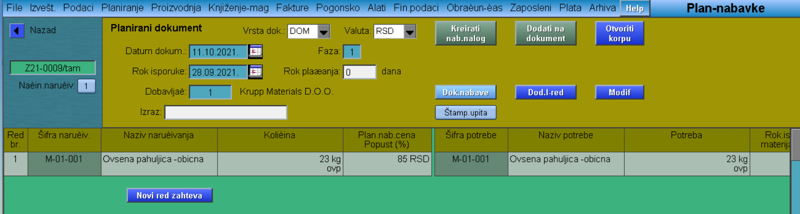
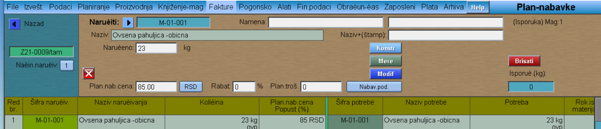
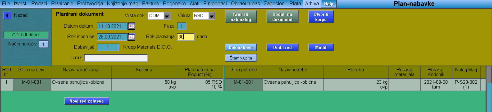

# Plan-nabavke

Program "Plan-nabavke" se poziva iz menija [Nabavka](../p11_sr.md)

Pojavljuje nam se prozor koji je podeljen na dva dela.  Desna strana prozora nam prikazuje listu potrebe nabavke, odnosno redove kreiranih Zahteva za nabavku. Leva strana nam prikazuje listu već formiranih korpi i mogućnost otvaranja nove korpe.

## Formiranje nove korpe

Pre formiranja nove korpe, možemo podesiti Tip robe (A-alati, T-trgovačka roba, R-repromaterijal, E-usluge).
U levom delu prozora klik na "Nova korpa" - otvara nam se lista dobavljača i biramo nama odgovarajućeg. **Napomena** : Dobavljač koga u ovom delu biramo, ne mora da bude dobaljač koji je biran u redu Zahteva za nabavku koju smeštamo u korpu! 
Kada nam se otvorila korpa, sa desne strane, iz liste biramo one stavke koje želimo da smestimo u korpu i to jednostavno klikom na Šifru stavke. Kada smo prebacili svaku potrebnu stavku klikom na dugme "Zatvaranje" zatvaramo korpu.
 Otvara nam se Planirani dokument gde upisujemo Rok plaćanja.
 
 
 
  U ovom delu postoji mogućnost izmene stavke i to klikom na šifru naručivanja. Možemo izmeniti količinu, rabat,...

 Na primeru ispod možemo videti, da nakon izmena, u istom prozoru možemo videti koje su količine bile potrebne, a koje su zapravo naručene.

 Zatim idemo na dugme "Kreirati nabavni nalog" i program nas automatski prebacuje u Dokument nabavke-lista svih naloga nabavke (ovde možemo da štampamo nalog sa "Štamp.nalog")

