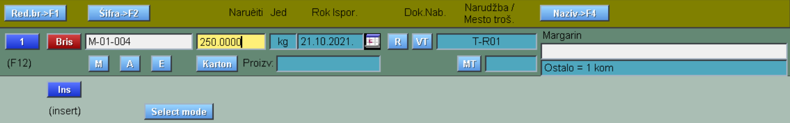
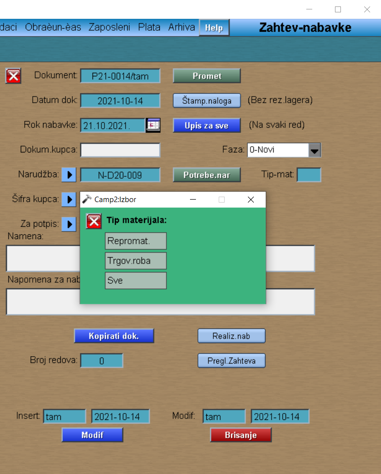
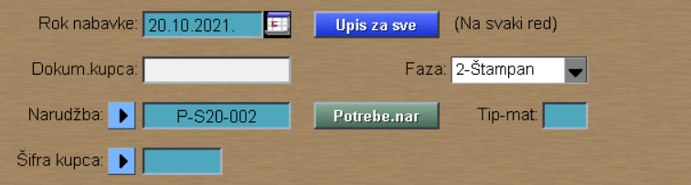

# Zahtev-nabavke

Program "Zahtev-nabavke" se poziva iz menija [Nabavka](../p11_sr.md)

Zahtev za nabavku se može kreirati na dva načina:

-Preko redova prometa ili

-Preko redova konkretne narudžbe

## Preko redova prometa

Nakon što kliknemo na dugme "Promet", otvara nam se novi prozor. U oviru njega, sa dugmetom "Ins" otvaramo red. Klikom na dugme "M" biramo odgovarajući materijal, upisujemo željenu količinu, rok i vrstu troškova.

U slučaju unosa većeg broja redova prometa, možemo koristiti sledeće tastere za njihovo filtriranje:

Red.br>F1 - filtriranje po rednom broju

Šifra>F2 - filtriranje po šifri stavke

Naziv>F4 - filtriranje po nazivu robe

 Klikom na broj reda, zatvaramo red (takodje klikom na broj reda, otvaramo red u slučaju da želimo da ispravimo upisane vrednosti). Nazad na prvobitni prozor zahteva. Klikom na dugme "Štampanje" faza dokumenta prelazi u Štampan. Na ovaj način smo dobili dokument Zahteva nabavke.

## Preko redova narudžbe

Klikom na strelicu pored Narudžba, otvaramo nam se prozor sa svim narudžbama. Iz ove tabele biramo nama odgovarajuću. "Potrebe.nar" (biramo tip materijala koji nam je potreban). 

U novo otvorenom prozoru biramo
"Upis potreba" -  "Štampanje naloga" - Nakon čega faza prelazi u 2-Štampan. 

Na ovaj način smo dobili nov dokument Zahteva nabavke.