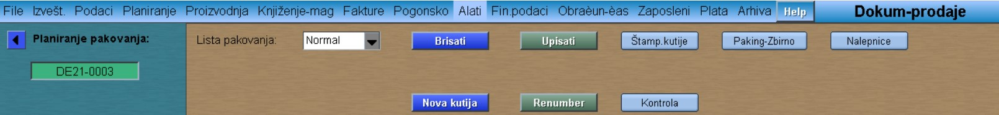

# Dokument-prodaje

Program "Dokument-prodaje" se poziva iz menija [Prodaja](../p12_sr.md)

Ukoliko otvaramo novi dokument, idemo na:

**Upis novog** -Program nam automatski dodeljuje sledeći broj dokumenta (Enter)

U novootvorenom prozoru :

- biramo kupca, 

- broj magacina  

- upisujemo datum (ne mora biti datum otpreme)

- u polje Napomene, upisujemo listu narudžbi ( Ixx-nnn, Ixx-mmm )

- fazu prodaje podešavamo na Aktivan

**Promet**

**Dodati sastav narudžbe**

Vraćamo se na startni ekran

U okviru Dokumenta prodaje, moguće je kreiranje i paking liste i to na sledeći način :

**Planir.pak.**

Kod Liste pakovanja podesiti na "Normal"   ("Mix" služi za unos mešanih kutija ručno)

**Upisati** (upisuje listu)

**Brisati** (briše listu)

**Kontrola** (prikazuje nam dal je svaki komad smešten u kutije ili je preostala neka količina)

Nazad na startni ekran

**Paking**

**Planiranje**

**Import plana** (rastavlja plan na pojedinačne kutije)
Zatvaramo prozor za planiranje

**Narudžbe** (Upisuje narudžbe u redove)

## Ručno kreiranje paking liste

Kreiranje paking liste se može vršiti i ručno (tj.kutija po kutiju) na sledeći način:

Otvorimo novi dokument prodaje ( podesimo kupca, magacin, datum, fazu prodaje-aktivan)

**Paking**

**Insert box**

Izaberemo šifru kutije klikom na "D" (npr. D-0000_019), količnu podesimo na 1 komad.

**Modif**

Kliknemo na broj kutije, zatim **Novi red**

Ponovo biramo šifru klikom na "D", ali ovaj put biramo šifru proizvoda koji se pakuje u kutije. Upisujemo količinu,tj. broj komada proizvoda koji ulazi u jednu kutiju.

**Modif**

Kliknemo na broj kutije, zatim **Copy box** unoliko puta,koliko je potrebno. 
(Npr.ako imamo ukupno 120 komada tašni, u jednu kutiju nam stane 10 komada,to znaci da trebamo još 11 puta da kopiramo istu tu kutiju kako bi dobili ukupnu količinu od 120 komada tašni.)