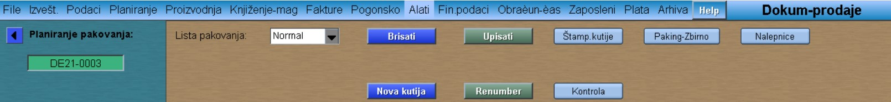

# Planiranje-paking

Planiranje paking je potprogram iz programa  [Dok-Prodaja]
[Dokument-prodaje](../mk503_sr.md)

**Planir.pak.**

Kod Liste pakovanja podesiti na "Normal"   ("Mix" služi za unos mešanih kutija ručno)

**Upisati** (upisuje listu)

**Brisati** (briše listu)

**Kontrola** (prikazuje nam dal je svaki komad smešten u kutije ili je preostala neka količina)

Nazad na startni ekran:
[Dokument-prodaje](../mk503_sr.md)
