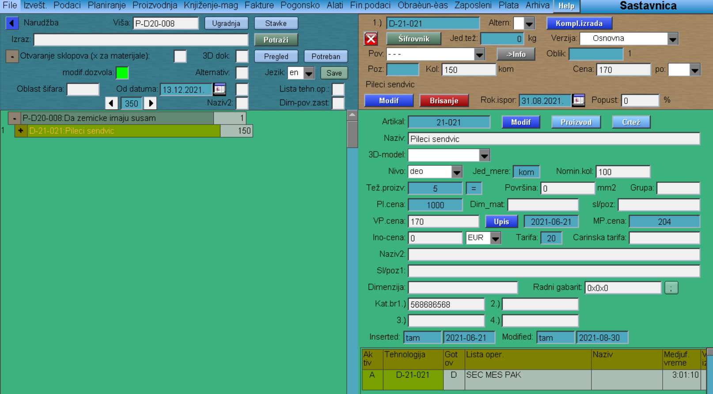

# Narudžba

Program "Narudžba" se poziva iz menija [Planiranje](../p1_sr.md)

Nakon što smo izabrali Proizvodni program, program nam automatski dodeljuje sledeći broj narudžbe. Klikom na dugme "Upis" otvara nam se prozor narudžbe.
Polja za popunjavanje su:

- Naziv (u ovo polje se može uneti komentar ili tekst vezan za narudžbu)
- Naručilac (Primalac, Krajnji kupac) **
- Rok isporuke
- Rok nabavke
- Vreme izrade (broj dana; unosom broja dana u ovo polje automatski se dobija ROK IZRADE)
Proveriti: TIP NALOGA, VALUTU, JEZIK.

"Modif"

** Ukoliko smo kod proizvodnog programa izabrali Sopstvenu proizvodnju, u polju Naručilac, će nam se pojaviti automatski podaci naše firme.

"Komponenti" 

Klikom na ovo dugme nam se otvara prozor, sa čije leve strane nam se pojavi lista proizvoda koje ulaze u narudžbu,

 a sa desne strane klikom na dugme "Proizvod" biramo te proizvode.

 "Proizvod"

"Izbor" - tabela iz koje biramo željeni proizvod, klikom na šifru proizvoda.

 Zatim upisujemo količinu, prod.cenu, rabat (ako je neophodno).

Kada smo ubacili svaki proizvod, tada idemo na dugme "Upis komponenti"

"Proizv.sastavn."

Klikom na ovo dugme dobijamo uvid (sa leve strane) u listu proizvoda koje sačinjavaju našu narudžbu. 

Klikom na šifru proizvoda iz liste (i klikom na znak "+" ispred šifre proizvoda), sa desne strane prozora nam se pojavljuje Sastavnica dotičnog proizvoda (u slučaju potrebe, ovde možemo menjati količinu).

 Imamo uvid u osnovne podatke, kao i tehnologiju proizvoda.

Ovim koracima smo sačinili narudžbu, a sledeći korak je Lansiranje.

=======
# Narudžba
