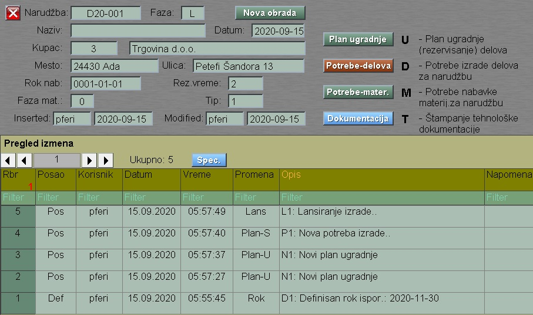
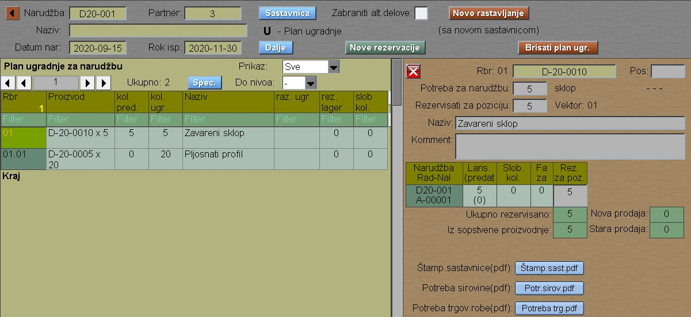
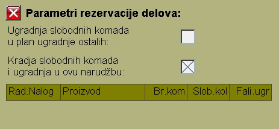

# Lansiranje

Program Lansiranje se poziva iz menija [Planiranje](../p1_sr.md)

Posle izbora narudžbe imamo:

Faza narudžbe može da bude:

U - Upisana narudžba bez obrade

P - Potrebe su upisane , izrada nije lansirana

L - Lansirani su nalozi da zadovolje potrebe

## Nova obrada

## U - Plan ugradnje

Kod plana ugradnje planiramo izradu narudžbe:

"Novo rastavljanje" je obrada koja sastavnicu narudžbe
ponovo prebacuje u plan ugradnje 

"Nove rezervacije" je obrada koja dodeljuje slobodne komade
radnih naloga u ove redove plana ugradnje. 

Slobodni komadi u izradi su oni koji nisu rezervisani u 
plan ugradnje ili su rezervisani za lager, tj za narudžbu
gde je kupac sopstvena firma.

### Parametri:

Na desnoj strani posle ulaza u ovaj deo imamo taster "Parametri".
Ovde biramo parametre rezervacije naloga:

Kod " kradje "  imamo odredjene uslove , koji 
zabranjuju ili dozvoljavaju ugradnju komada jedne
narudžbe u drugu.
- samo narudžba sopstvene izrade može da nudi
  svoje naloge za kradju komada.
- samo narudžba kupca može prihvatiti te slobodne komade
  i ugraditi ih u svoju strukturu.

## D - Potrebe-delova

## M - Potrebe-materijala

## T - Tehnološka dokumentacija
