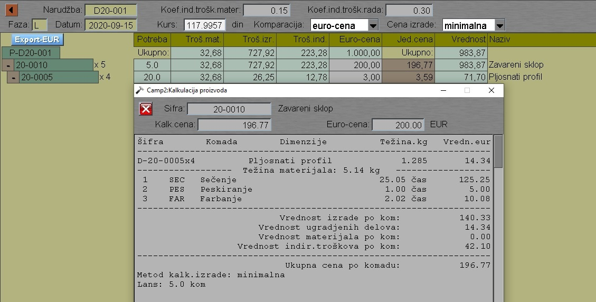

# Kalk-ponude

Program "Kalk-ponude" se poziva iz menija [Planiranje](../p1_sr.md)

Program radi kalkulaciju dokumenta:

- Ponude
- Narudžbe

Posle izbora dokumenta program kalkuliše elemente dokumenta:

Klik na proizvod nam daje prikaz kalkulacije tog proizvoda u
posebnom prozoru.

Troškove proizvoda dobijamo kao zbir:
- materijalnih
- radnih i
- indirektnih troškova.

Kod exporta podataka imamo i mogućnost množenja 
sa koeficijentom prodaje.
