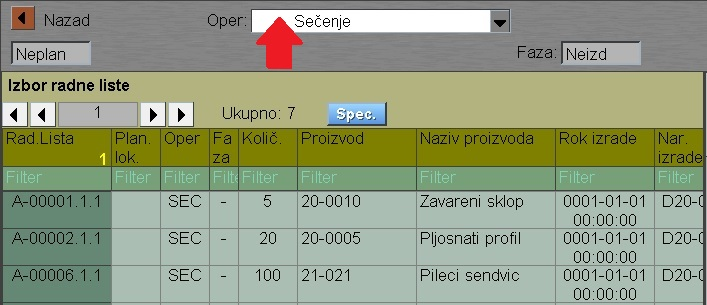
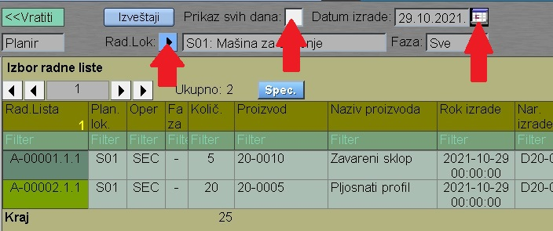
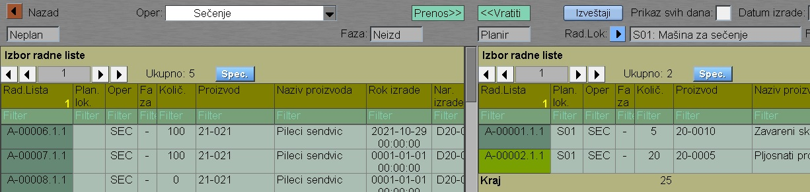

# Planir-izrade

Program "Planir-izrade" se poziva iz menija [Plan-izrade](../p1i_sr.md)

**Leva strana** 

Na levoj strani su neplanirane operacije.

Ovde biramo operaciju koju želimo da stavimo u plan izrade:

**Desna strana** 

Na desnoj strani su operacije koje su stavljene u plan izrade:

- Prvo biramo radnu lokaciju čije operacije želimo da vidimo
- Zatim biramo da li želimo prikaz svih datuma (X) ili samo jedan datum
- Zatim biramo datum, na koji želimo staviti operacije.

Ako smo sve dobro podeili, onda gore na levoj strani ekrana vidimo znak za "Prenos >>", a na desnoj strani vidimo znak za "<< Vratiti" . 

To znači da ako kliknemo na red operacije na levoj strani, onda ta operacija prelazi na desnu stranu u plan izrade.

Ako kliknemo na red operacije na desnoj strani , onda ta operacija se vraća na levu stranu na listu neizdatih.

Pored tih tastera je taster "Izveštaji" , koji nas vodi na ekran, gde su razni izveštaji za prikaz plana izrade.
