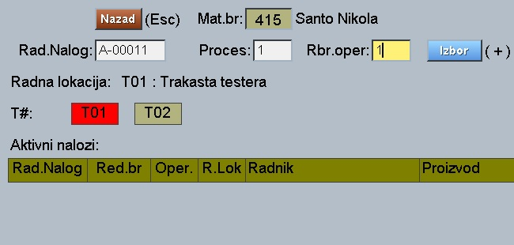
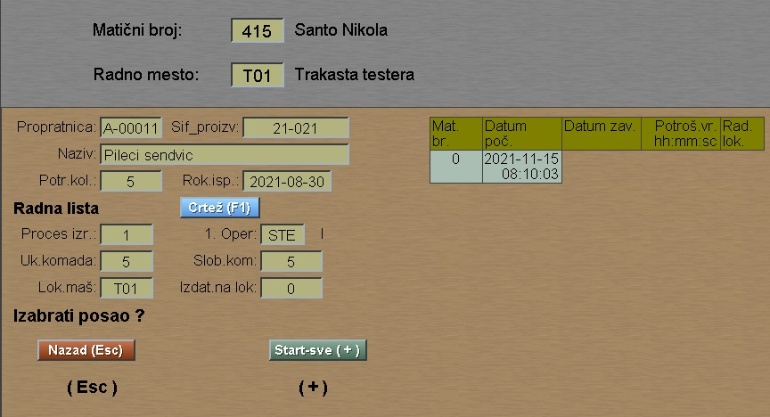
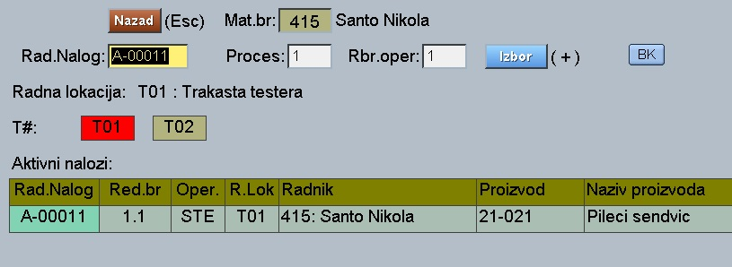
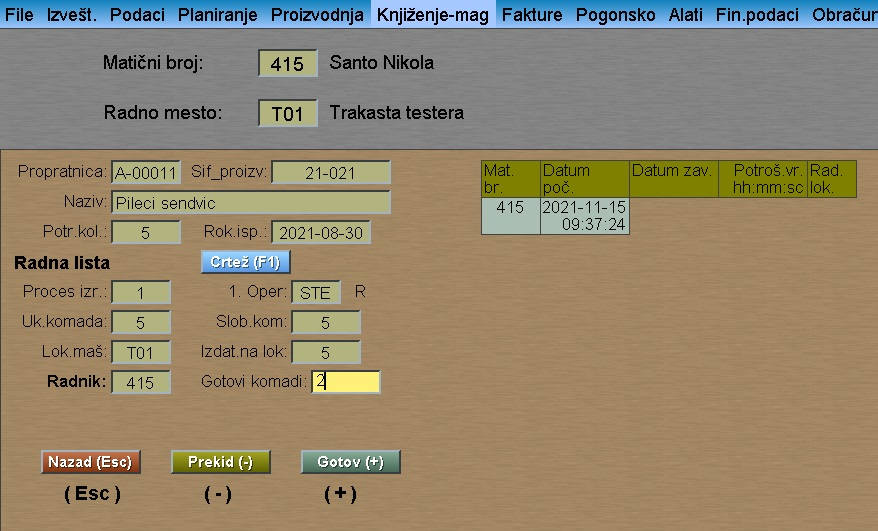

# Dnevna izrada

Program "Dnevna-izrada" se poziva iz menija [Specijal](../p23_sr.md)

**Preduslovi za rad:**

a) Kod radne lokacije upisati predvidjene tehnološke operacije

    Na primer: kod lokacije T01 , T02 upisati
    da je ze operaciju: 
      STE - secenje testerom 

b) Kod radnika upisati njegova radna mesta

    Na primer kod 415: Santo Nikola upisati da 
    radi na lokacijama : T01 , T02

c) Startovati radni nalog sa fazom iz seta (+ N),
zatim izdati operaciju na izradu

     Na primer izdati operaciju STE na radno mesto 
     iz seta (T#,T01,T02..)

**Startovanje** 

Program dnevna izrada se startuje jedan put svaki dan.

    Obično prvi radnik upisuje:
    user: RL , pass: 111 

**Ulazak u program:** 

Radnik koji startuje posao prvo upisuje matični broj, na primer: 415

**Startovanje posla:**

Radnik odabira konkretno radno mesto: T01

Zatim barkod citacem ubacuje nalog

    Na primer A-00011  proces: 1 rbr: 1

Zatim na taster "Izbor"(+) pokazuje podatke posla:

i na taster "Start-sve"(+) startuje posao.
Program automatski izlazi na početni ekran.

**Kraj posla**

Kad je zavrsio ili kad želi prekid posla,
radnik ponovo ulazi sa mat.brojem: 415

Program tada nudi poslove koji su prekinuti:

Posle izbora aktivnog posla program opet
pokazuje podatke posla:

Ovde radnik upisuje broj gotovih komada
zatim taster "Prekid"(-) ili taster "Gotov" (+)
u zavisnosti od toga da li prekida posao
ili je posao završen.

