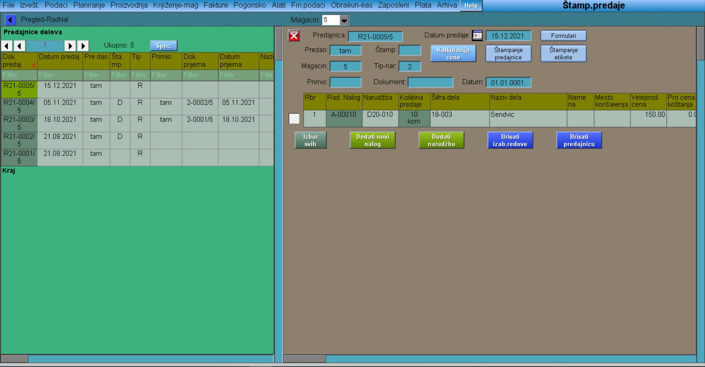

# Štampanje-predaje

Program "Štampanje-predaje" se poziva iz menija [Proizvodnja](../p2_sr.md)

Podešavaju se sledeće stavke:

- datum predaje
- tip naloga (2-domaća prodaja; 4-sopstvena proizvodnja)
- broj magacina u koji predajemo robu (magacin gotove robe)

"Nova predaja"    
(Dobijamo broj dokumenta R21-xxxx/5)

"Dodati nov nalog"     
(Biramo dotični radni nalog)

"Štampati predajnice"     
(Ovaj primerak dobija magacioner)

Napomena: Ovim korakom proizvod još nije predat u magacingotove robe, već je samo stavljen na dokument. Da bi bio premešten u magacin gotove robe, potrebno je da ga magacioner proknjiži (u programskom delu Knjizenje magacina-Knjiženje predaje).