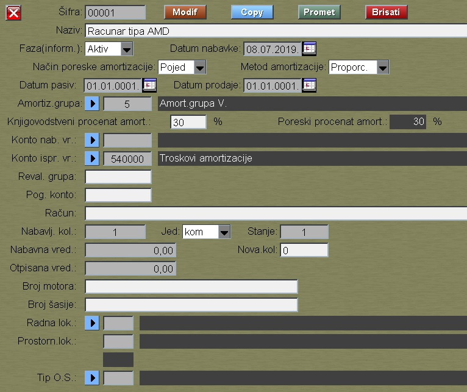
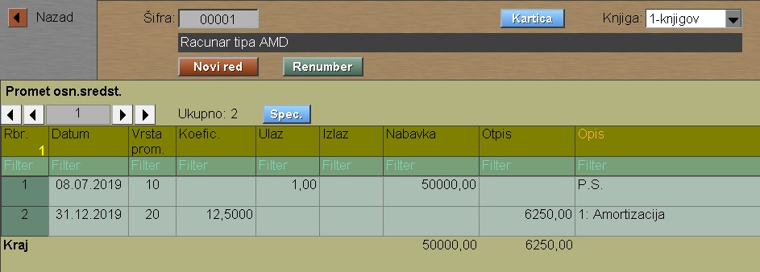
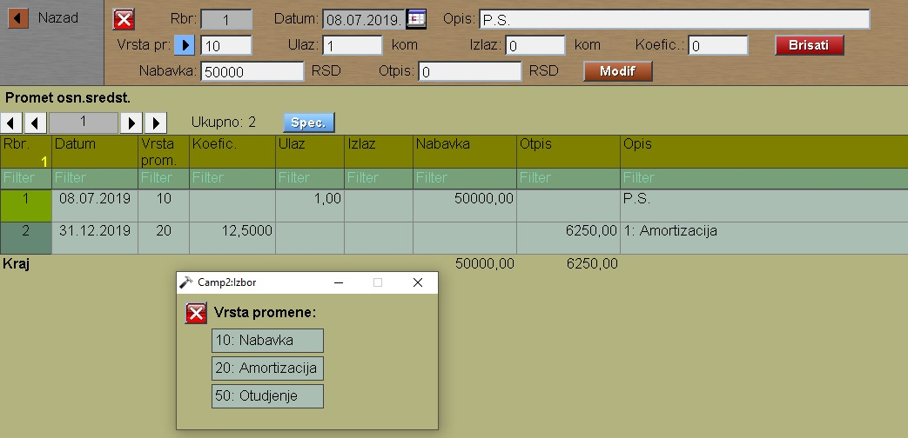

# Osnovno sredstvo

Program "Osnovno sredstvo" se poziva iz menija [Alati](../r1_sr.md)

Pritiskom na taster "Promet" ulazimo u deo gde se vode promene
vrednosti osnovnog sredstva:

Promet se vodi posebno za karticu:

  1-knjigov kartica

  2-poreska kartica

Kod svakog prometa moramo zadati vrstu prometa:

